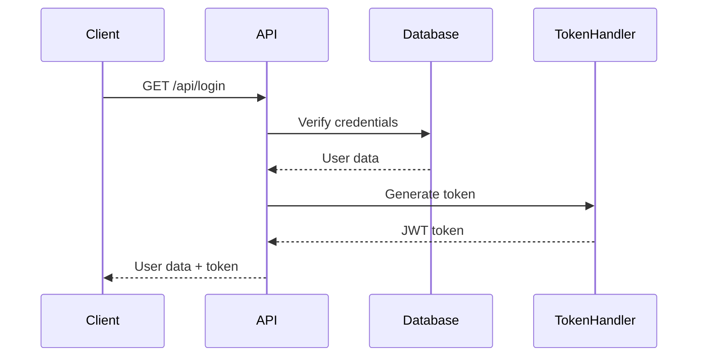
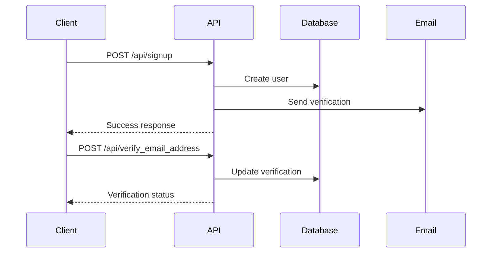

# Current API Endpoints Documentation

## Authentication
- `GET /api/login` - User login
- `POST /api/signup` - User registration
- `POST /api/verify_email_address` - Email verification
- `POST /api/resend_verification_code` - Resend verification code
- `POST /api/forgot_password` - Password recovery
- `POST /api/update_password` - Update password

## User Management
- `GET /api/userdata` - Get user data
- `POST /api/update_userdata` - Update user data
- `POST /api/upload_user_image` - Upload user profile image
- `POST /api/account_disable` - Disable user account

## Courses
- `GET /api/top_courses` - Get top courses
- `GET /api/course_object_by_id` - Get course by ID
- `GET /api/my_courses` - Get user's enrolled courses
- `GET /api/course_details_by_id` - Get detailed course information
- `GET /api/category_wise_course` - Get courses by category
- `GET /api/filter_course` - Filter courses
- `GET /api/courses_by_search_string` - Search courses

## Categories
- `GET /api/all_categories` - Get all categories
- `GET /api/categories/{id}` - Get category by ID
- `GET /api/sub_categories/{parent_id}` - Get subcategories

## Course Content
- `GET /api/sections` - Get course sections
- `GET /api/section_wise_lessons` - Get lessons by section
- `GET /api/lesson_details` - Get lesson details
- `GET /api/save_course_progress` - Save course progress

## Wishlist
- `GET /api/my_wishlist` - Get user's wishlist
- `GET /api/toggle_wishlist_items` - Toggle wishlist items

## Quiz
- `POST /api/submit_quiz` - Submit quiz answers
- `GET /api/quiz_mobile_web_view` - Get quiz web view

## Bundles
- `GET /api/bundles` - Get course bundles
- `GET /api/bundle_courses` - Get courses in bundle
- `GET /api/my_bundles` - Get user's bundles
- `GET /api/my_bundle_course_details` - Get bundle course details

## Forum
- `POST /api/forum_add_questions` - Add forum question
- `GET /api/forum_questions` - Get forum questions
- `GET /api/search_forum_questions` - Search forum questions
- `POST /api/add_questions_reply` - Add reply to question
- `GET /api/forum_child_questions` - Get question replies
- `GET /api/forum_question_vote` - Vote on question
- `GET /api/forum_question_delete` - Delete question

## System
- `GET /api/app_logo` - Get application logos
- `GET /api/system_settings` - Get system settings
- `GET /api/languages` - Get available languages
- `GET /api/certificate_addon` - Get certificate addon status
- `GET /api/addon_status` - Get addon statuses

## Live Classes
- `GET /api/zoom_live_class` - Get Zoom live classes
- `GET /api/zoom_mobile_web_view` - Get Zoom web view

## Watch History
- `POST /api/update_watch_history` - Update watch history

## Mobile Views
- `GET /api/lesson_mobile_web_view` - Get lesson mobile view

## Data Models

### User Model
```json
{
    "id": "integer",
    "first_name": "string",
    "last_name": "string",
    "email": "string",
    "role_id": "integer",
    "is_instructor": "boolean",
    "status": "boolean"
}
```

### Course Model
```json
{
    "id": "integer",
    "title": "string",
    "description": "text",
    "price": "decimal",
    "discount_flag": "boolean",
    "discounted_price": "decimal",
    "status": "boolean"
}
```

### Category Model
```json
{
    "id": "integer",
    "name": "string",
    "parent": "integer",
    "slug": "string",
    "status": "boolean"
}
```

### Lesson Model
```json
{
    "id": "integer",
    "title": "string",
    "duration": "string",
    "course_id": "integer",
    "section_id": "integer",
    "video_type": "string",
    "video_url": "string",
    "lesson_type": "string",
    "attachment": "string"
}
```

## Authentication Flow

1. **Login Process**


2. **Registration Process**


## Migration Considerations

1. **API Versioning**
   - Implement v1 namespace for current endpoints
   - Plan v2 with improved REST compliance
   - Maintain backward compatibility

2. **Authentication Updates**
   - Move to JWT-based authentication
   - Implement refresh tokens
   - Add OAuth2 support

3. **Response Format Standardization**
   - Consistent error responses
   - Proper HTTP status codes
   - Pagination metadata
   - Resource relationships

4. **Security Enhancements**
   - Rate limiting
   - Input validation
   - CORS policies
   - API key management 