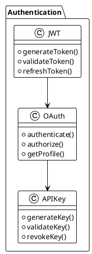
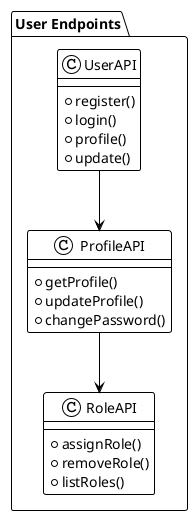
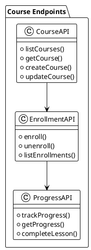
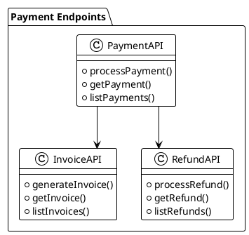

# API Analysis

## Overview
This document analyzes the API structure of the LMS platform, its endpoints, and integration points.

## API Structure

### Authentication

### Endpoints

#### User Endpoints

#### Course Endpoints

#### Payment Endpoints

## Integration Points

### Authentication Flow
1. Token Generation
   - JWT token creation
   - Token expiration
   - Refresh token
   - Token validation

2. OAuth Integration
   - Social login
   - Profile synchronization
   - Account linking
   - Data import

3. API Key Management
   - Key generation
   - Key validation
   - Key revocation
   - Rate limiting

### Data Access
1. User Data
   - Profile information
   - Role assignments
   - Preferences
   - Activity history

2. Course Data
   - Course content
   - Enrollment status
   - Progress tracking
   - Completion records

3. Payment Data
   - Transaction history
   - Invoice records
   - Refund status
   - Payment methods

### Webhook Integration
1. Event Types
   - User events
   - Course events
   - Payment events
   - System events

2. Webhook Configuration
   - Endpoint setup
   - Event selection
   - Security settings
   - Retry policy

3. Payload Structure
   - Event data
   - Metadata
   - Timestamps
   - Signatures

## Security Measures

### Authentication
1. Token Security
   - JWT encryption
   - Token expiration
   - Refresh rotation
   - Blacklist management

2. API Key Security
   - Key encryption
   - Rate limiting
   - IP restrictions
   - Usage monitoring

3. OAuth Security
   - State validation
   - Scope management
   - Token validation
   - Profile verification

### Data Protection
1. Encryption
   - Data at rest
   - Data in transit
   - Key management
   - Certificate handling

2. Access Control
   - Role-based access
   - Permission checks
   - Resource ownership
   - Audit logging

3. Input Validation
   - Data sanitization
   - Type checking
   - Length validation
   - Format verification

## Rate Limiting

### Implementation
1. Token Bucket
   - Request counting
   - Time window
   - Burst handling
   - Queue management

2. IP Based
   - IP tracking
   - Block listing
   - Allow listing
   - Geo restrictions

3. User Based
   - User tracking
   - Tier management
   - Usage monitoring
   - Quota enforcement

### Configuration
1. Limits
   - Request per minute
   - Request per hour
   - Request per day
   - Burst allowance

2. Headers
   - Rate limit
   - Remaining requests
   - Reset time
   - Retry after

3. Responses
   - Status codes
   - Error messages
   - Retry information
   - Documentation links

## Documentation

### API Documentation
1. Endpoint Documentation
   - URL structure
   - HTTP methods
   - Request parameters
   - Response format

2. Authentication Documentation
   - Token generation
   - API key usage
   - OAuth flow
   - Security requirements

3. Integration Documentation
   - Webhook setup
   - Event types
   - Payload structure
   - Error handling

### Client Libraries
1. Language Support
   - PHP
   - JavaScript
   - Python
   - Java

2. SDK Features
   - Authentication
   - Request handling
   - Response parsing
   - Error management

3. Examples
   - Basic usage
   - Authentication
   - Data access
   - Webhook handling 