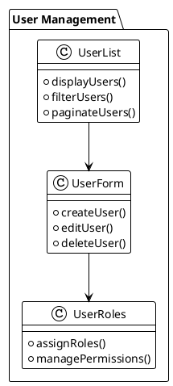
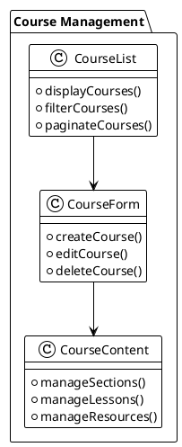
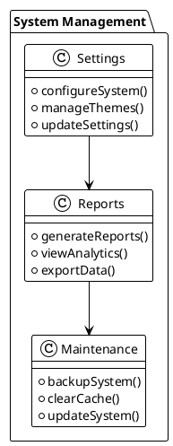

# Backend View Analysis

## Overview
This document analyzes the backend views of the LMS platform, their structure, and their role in the admin interface.

## View Structure

### Layout Components
1. Header
   - `header.php`: Main admin header
   - `header_notification.php`: Notification header
   - `metas.php`: Meta tags

2. Footer
   - `footer.php`: Main admin footer
   - `includes_bottom.php`: Bottom includes
   - `includes_top.php`: Top includes

3. Common Components
   - `modal.php`: Modal dialogs
   - `common_scripts.php`: Common JavaScript
   - `init.php`: Initialization scripts

## Admin Interface Structure

### User Management

### Course Management

### System Management

## Vue 3 Migration Strategy

### Admin Components
1. Layout Components
   - Admin header component
   - Admin footer component
   - Admin sidebar component
   - Admin modal component

2. Management Components
   - User management component
   - Course management component
   - System management component
   - Report management component

3. Form Components
   - User form component
   - Course form component
   - Settings form component
   - Report form component

### State Management
1. Vuex Store Modules
   - Admin module
   - User module
   - Course module
   - System module

2. State Structure
   - Admin state
   - User state
   - Course state
   - System state

### Routing
1. Route Structure
   - Dashboard routes
   - User management routes
   - Course management routes
   - System management routes

2. Route Guards
   - Admin authentication guard
   - Permission guard
   - Role guard

### API Integration
1. API Services
   - Admin service
   - User service
   - Course service
   - System service

2. API Configuration
   - Base URL
   - Headers
   - Interceptors
   - Error handling

## Modularization Strategy

### Component Organization
1. Core Components
   - Admin layout components
   - Admin UI components
   - Admin form components

2. Feature Components
   - User management components
   - Course management components
   - System management components

3. Shared Components
   - Common admin components
   - Utility components
   - Service components

### Style Organization
1. Global Styles
   - Admin variables
   - Admin mixins
   - Admin utilities

2. Component Styles
   - Scoped styles
   - Module styles
   - Theme styles

### Asset Management
1. Static Assets
   - Admin images
   - Admin fonts
   - Admin icons

2. Dynamic Assets
   - User uploads
   - Course content
   - System files 