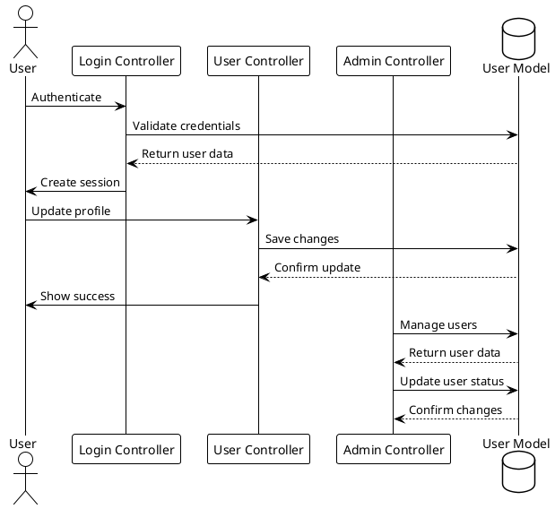
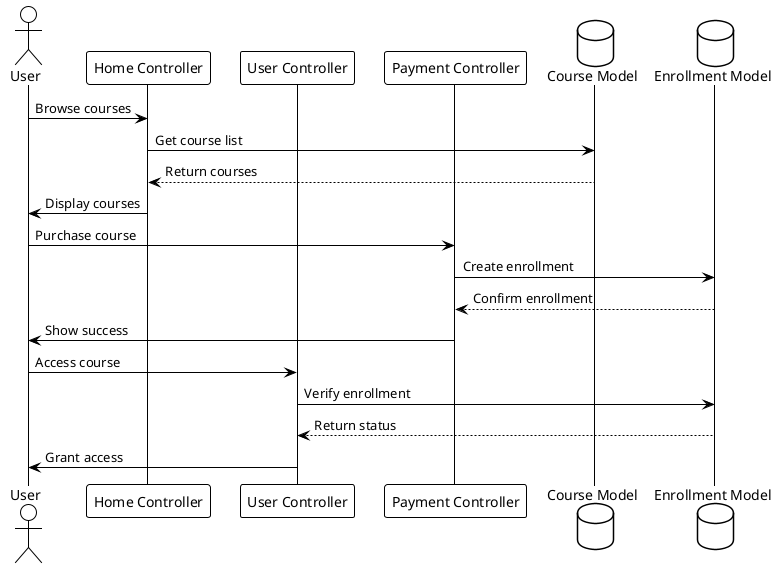
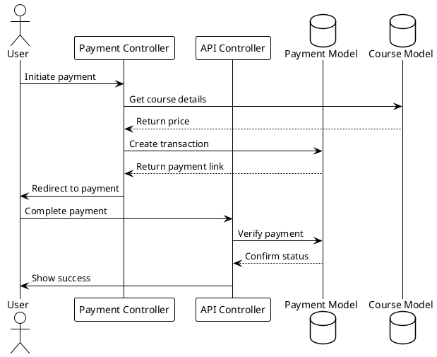

# Controller Analysis

## Overview
This document analyzes the core controllers of the LMS platform, their responsibilities, and the business logic they implement.

## Core Controllers

### Admin Controller
- System administration
- User management
- Course management
- Settings configuration
- Reports and analytics

### User Controller
- User profile management
- Course enrollment
- Progress tracking
- Certificate management
- Account settings

### Payment Controller
- Payment processing
- Transaction management
- Invoice generation
- Refund handling
- Payment gateway integration

### API Controller
- REST API endpoints
- Authentication
- Data access
- Integration points
- Webhook handling

### Home Controller
- Course browsing
- Search functionality
- Category management
- Featured content
- Landing pages

### Login Controller
- Authentication
- Session management
- Password reset
- Social login integration
- Security measures

## Business Logic Flow

### User Management Flow

### Course Management Flow

### Payment Processing Flow

## Integration Points

### API Integration
- REST endpoints
- Authentication
- Data access
- Webhook handling
- Rate limiting

### Payment Gateway Integration
- Transaction processing
- Status verification
- Refund handling
- Invoice generation
- Webhook processing

### User Management Integration
- Authentication
- Authorization
- Profile management
- Role management
- Session handling

## Modularization Strategy

### Controller Responsibilities
1. Admin Controller
   - System configuration
   - User management
   - Course management
   - Analytics

2. User Controller
   - Profile management
   - Course access
   - Progress tracking
   - Certificates

3. Payment Controller
   - Transaction processing
   - Gateway integration
   - Invoice management
   - Refund handling

4. API Controller
   - Endpoint management
   - Authentication
   - Data access
   - Webhook handling

### Service Layer Implementation
1. Create service classes for:
   - User management
   - Course management
   - Payment processing
   - API handling

2. Implement interfaces for:
   - User services
   - Course services
   - Payment services
   - API services

3. Use dependency injection for:
   - Service classes
   - Repository classes
   - Helper classes
   - Configuration

4. Implement event system for:
   - User actions
   - Course updates
   - Payment processing
   - API calls 