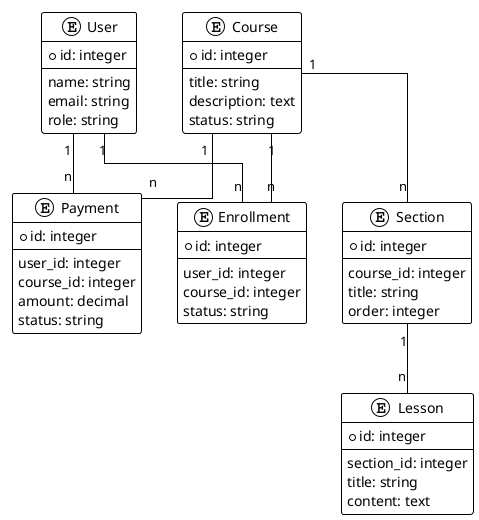

# Core Models Analysis

## Overview
This document analyzes the core models of the LMS platform, their relationships, and their role in the system architecture.

## Model Structure
Let's examine the core models in the system:

### User Model
- Primary user management
- Authentication and authorization
- Profile management
- Role-based access control

### Course Model
- Course content management
- Course metadata
- Course status and visibility
- Course pricing and enrollment

### Enrollment Model
- Student enrollment tracking
- Course progress
- Completion status
- Access control

### Payment Model
- Payment processing
- Transaction tracking
- Invoice generation
- Refund handling

### Section Model
- Course structure organization
- Content hierarchy
- Progress tracking
- Access control

### Lesson Model
- Content delivery
- Progress tracking
- Assessment integration
- Resource management

## Relationships

## Business Logic
Each model contains specific business logic:

### User Model
- Authentication
- Authorization
- Profile management
- Role management

### Course Model
- Content management
- Pricing
- Visibility control
- Enrollment management

### Enrollment Model
- Access control
- Progress tracking
- Completion management
- Certificate generation

### Payment Model
- Transaction processing
- Invoice generation
- Refund handling
- Payment gateway integration

### Section Model
- Content organization
- Progress tracking
- Access control
- Order management

### Lesson Model
- Content delivery
- Progress tracking
- Assessment integration
- Resource management

## Integration Points
Key integration points for modularization:

1. User Management
   - Authentication
   - Authorization
   - Profile management

2. Content Management
   - Course structure
   - Content delivery
   - Progress tracking

3. Payment Processing
   - Transaction handling
   - Gateway integration
   - Invoice management

4. Enrollment Management
   - Access control
   - Progress tracking
   - Completion management

## Modularization Strategy
To make the system modular, we need to:

1. Create separate packages for:
   - User management
   - Course management
   - Payment processing
   - Enrollment management

2. Implement service providers for:
   - Authentication
   - Authorization
   - Content delivery
   - Payment processing

3. Create facades for:
   - User management
   - Course management
   - Payment processing
   - Enrollment management

4. Set up event system for:
   - User actions
   - Course updates
   - Payment processing
   - Enrollment changes 