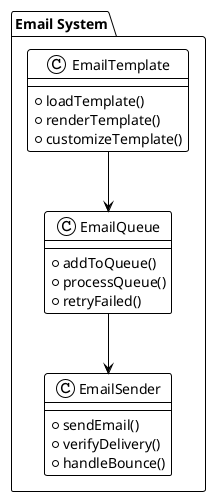
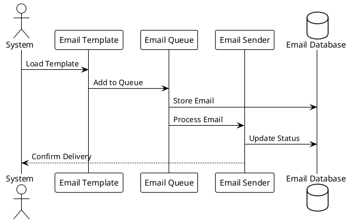
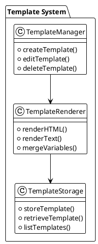

# Email System Analysis

## Overview
This document analyzes the email system of the LMS platform, its structure, and integration points.

## Email System Structure

### Core Components

### Email Flow

### Template System

## Email Types

### User Emails
1. Authentication
   - Welcome email
   - Verification email
   - Password reset
   - Account activation

2. Course Related
   - Enrollment confirmation
   - Course completion
   - Progress updates
   - Certificate delivery

3. Payment Related
   - Payment confirmation
   - Invoice delivery
   - Refund notification
   - Subscription updates

### System Emails
1. Notifications
   - System updates
   - Maintenance alerts
   - Security alerts
   - Policy updates

2. Reports
   - Daily reports
   - Weekly reports
   - Monthly reports
   - Custom reports

3. Alerts
   - Error alerts
   - Warning alerts
   - Success alerts
   - Information alerts

## Template Management

### Template Types
1. HTML Templates
   - Responsive design
   - Custom styling
   - Dynamic content
   - Image support

2. Text Templates
   - Plain text
   - Formatted text
   - Variable support
   - Link support

3. Custom Templates
   - User defined
   - System defined
   - Brand specific
   - Language specific

### Template Variables
1. User Variables
   - Name
   - Email
   - Role
   - Preferences

2. Course Variables
   - Course name
   - Course URL
   - Instructor
   - Progress

3. System Variables
   - Date
   - Time
   - System name
   - Support contact

## Email Delivery

### Delivery Methods
1. SMTP
   - Direct delivery
   - Relay server
   - Authentication
   - Encryption

2. API
   - Third-party service
   - Webhook integration
   - Status tracking
   - Error handling

3. Queue
   - Batch processing
   - Priority handling
   - Retry logic
   - Rate limiting

### Delivery Tracking
1. Status Monitoring
   - Sent status
   - Delivery status
   - Bounce status
   - Open status

2. Analytics
   - Delivery rate
   - Open rate
   - Click rate
   - Bounce rate

3. Reporting
   - Delivery reports
   - Bounce reports
   - Open reports
   - Click reports

## Integration Points

### System Integration
1. User System
   - User preferences
   - Email preferences
   - Notification settings
   - Language settings

2. Course System
   - Course notifications
   - Progress updates
   - Completion alerts
   - Certificate delivery

3. Payment System
   - Payment notifications
   - Invoice delivery
   - Refund notifications
   - Subscription updates

### External Integration
1. Email Services
   - SMTP servers
   - Email APIs
   - Delivery services
   - Analytics services

2. Marketing Tools
   - Campaign management
   - List management
   - Analytics integration
   - A/B testing

3. Analytics Tools
   - Email analytics
   - User analytics
   - Campaign analytics
   - ROI tracking

## Security Measures

### Email Security
1. Authentication
   - SMTP authentication
   - API authentication
   - Domain verification
   - SPF/DKIM/DMARC

2. Encryption
   - TLS encryption
   - PGP encryption
   - Content encryption
   - Attachment encryption

3. Compliance
   - GDPR
   - CAN-SPAM
   - Local regulations
   - Industry standards

### Data Protection
1. Personal Data
   - Email addresses
   - User information
   - Payment details
   - Course data

2. Template Data
   - Template content
   - Variable data
   - Custom content
   - Brand assets

3. Delivery Data
   - Delivery logs
   - Status updates
   - Error logs
   - Analytics data 