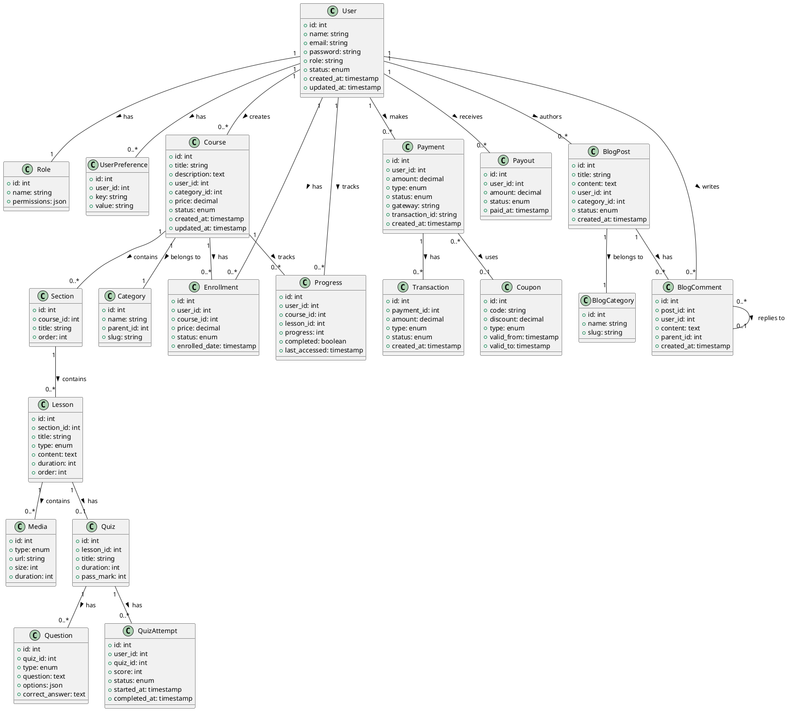

# Entity Relationship Diagram Documentation

## Overview
This document provides a comprehensive Entity Relationship Diagram (ERD) for the Learning Management System (LMS) platform. The ERD illustrates the relationships between all core entities in the system.

## Core Entities

### User Management
- Users
- Roles
- Permissions
- User Settings
- User Preferences

### Course Management
- Courses
- Sections
- Lessons
- Categories
- Enrollments
- Progress Tracking

### Content Management
- Media Files
- Attachments
- Resources
- Quiz Questions
- Quiz Attempts

### Payment System
- Payments
- Transactions
- Refunds
- Payouts
- Coupons

### Blog System
- Blog Posts
- Blog Categories
- Blog Comments
- Blog Settings

## PlantUML Diagram

## Entity Descriptions

### User Management
- **User**: Core entity representing system users (students, instructors, admins)
- **Role**: Defines user roles and associated permissions
- **UserPreference**: Stores user-specific settings and preferences

### Course Management
- **Course**: Main entity for educational content
- **Section**: Organizes course content into logical groups
- **Lesson**: Individual learning units within sections
- **Category**: Hierarchical organization of courses
- **Enrollment**: Tracks student course enrollments
- **Progress**: Monitors student progress through courses

### Content Management
- **Media**: Handles various types of media content
- **Quiz**: Assessment component of lessons
- **Question**: Individual quiz questions
- **QuizAttempt**: Records of student quiz attempts

### Payment System
- **Payment**: Records of financial transactions
- **Transaction**: Detailed payment transaction records
- **Payout**: Instructor payment records
- **Coupon**: Discount management

### Blog System
- **BlogPost**: Blog content management
- **BlogCategory**: Organization of blog posts
- **BlogComment**: User interactions with blog posts

## Key Relationships

1. **User-Course**
   - Users create courses (instructors)
   - Users enroll in courses (students)
   - Users track progress in courses

2. **Course Structure**
   - Courses contain sections
   - Sections contain lessons
   - Lessons may have quizzes and media

3. **Payment Flow**
   - Users make payments
   - Payments generate transactions
   - Instructors receive payouts

4. **Blog System**
   - Users create blog posts
   - Posts belong to categories
   - Users comment on posts

## Database Considerations

1. **Indexing**
   - Primary keys on all tables
   - Foreign key relationships
   - Composite indexes for common queries

2. **Constraints**
   - Referential integrity
   - Unique constraints
   - Check constraints

3. **Performance**
   - Denormalization where necessary
   - Caching strategies
   - Query optimization

4. **Security**
   - Role-based access control
   - Data encryption
   - Audit logging 