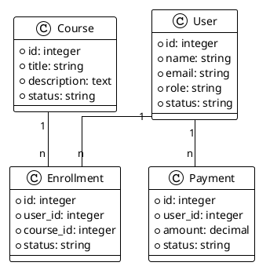
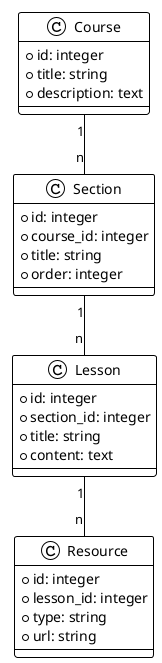
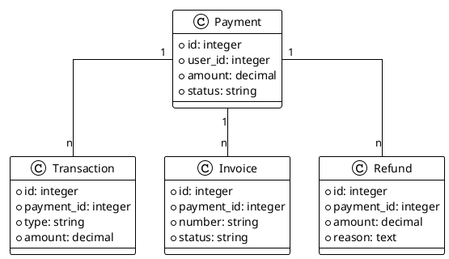

# Model Analysis

## Overview
This document analyzes the core models of the LMS platform, their relationships, and their role in the data structure.

## Core Models

### User Model
- User management
- Authentication
- Profile management
- Role management

### Course Model
- Course management
- Content organization
- Enrollment tracking
- Progress monitoring

### Payment Model
- Payment processing
- Transaction management
- Invoice generation
- Refund handling

### API Model
- API endpoints
- Authentication
- Data access
- Integration points

### Email Model
- Email templates
- Notification sending
- Email queue management
- Template customization

### Video Model
- Video content management
- Streaming configuration
- Quality settings
- Player customization

### JWT Model
- Token generation
- Token validation
- Token refresh
- Security management

### Social Login Model
- Social authentication
- Profile synchronization
- Account linking
- Data import

### Academy Cloud Model
- Cloud storage
- Content delivery
- File management
- Resource optimization

### Lazy Load Data Model
- Data pagination
- Performance optimization
- Resource management
- Cache handling

### Addon Model
- Addon management
- Feature activation
- Configuration handling
- Integration points

## Model Relationships

### User Relationships

### Course Relationships

### Payment Relationships

## Business Logic

### User Management
1. Authentication
   - Login validation
   - Password hashing
   - Session management
   - Token generation

2. Profile Management
   - Profile creation
   - Profile update
   - Avatar handling
   - Preferences management

3. Role Management
   - Role assignment
   - Permission checking
   - Access control
   - Role hierarchy

### Course Management
1. Content Organization
   - Course creation
   - Section management
   - Lesson organization
   - Resource handling

2. Enrollment Tracking
   - Enrollment processing
   - Access control
   - Progress monitoring
   - Completion tracking

3. Progress Monitoring
   - Lesson completion
   - Quiz results
   - Assignment submission
   - Certificate generation

### Payment Processing
1. Transaction Management
   - Payment processing
   - Gateway integration
   - Status tracking
   - Error handling

2. Invoice Generation
   - Invoice creation
   - Template management
   - PDF generation
   - Email delivery

3. Refund Handling
   - Refund processing
   - Policy enforcement
   - Status tracking
   - Notification sending

## Modularization Strategy

### Model Organization
1. Core Models
   - User model
   - Course model
   - Payment model
   - API model

2. Feature Models
   - Video model
   - Email model
   - Social login model
   - Academy cloud model

3. Utility Models
   - JWT model
   - Lazy load data model
   - Addon model

### Data Access Layer
1. Repository Pattern
   - User repository
   - Course repository
   - Payment repository
   - API repository

2. Service Layer
   - User service
   - Course service
   - Payment service
   - API service

3. Interface Layer
   - User interface
   - Course interface
   - Payment interface
   - API interface

### Event System
1. Model Events
   - User events
   - Course events
   - Payment events
   - API events

2. Event Handlers
   - User handlers
   - Course handlers
   - Payment handlers
   - API handlers

3. Event Listeners
   - User listeners
   - Course listeners
   - Payment listeners
   - API listeners 