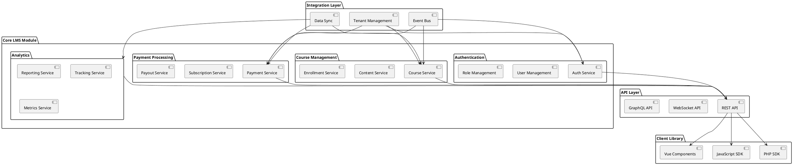

# Modularization Strategy

## Overview

This document outlines the strategy for modularizing the Learning Management System (LMS) platform, making it capable of being integrated into other Laravel applications while maintaining separation of concerns and data isolation.

## Module Architecture



## Module Structure

### 1. Core LMS Module

```plaintext
lms-module/
├── src/
│   ├── Authentication/
│   │   ├── Services/
│   │   ├── Models/
│   │   ├── Controllers/
│   │   └── Events/
│   ├── CourseManagement/
│   │   ├── Services/
│   │   ├── Models/
│   │   ├── Controllers/
│   │   └── Events/
│   ├── Payment/
│   │   ├── Services/
│   │   ├── Models/
│   │   ├── Controllers/
│   │   └── Events/
│   └── Analytics/
│       ├── Services/
│       ├── Models/
│       ├── Controllers/
│       └── Events/
├── config/
├── database/
│   ├── migrations/
│   └── seeders/
├── routes/
├── resources/
│   ├── views/
│   └── assets/
└── tests/
```

### 2. Integration Layer

```plaintext
integration/
├── src/
│   ├── TenantManagement/
│   │   ├── Services/
│   │   ├── Models/
│   │   └── Events/
│   ├── DataSync/
│   │   ├── Services/
│   │   ├── Models/
│   │   └── Events/
│   └── EventBus/
│       ├── Services/
│       ├── Models/
│       └── Events/
├── config/
├── database/
└── tests/
```

### 3. API Layer

```plaintext
api/
├── src/
│   ├── REST/
│   │   ├── Controllers/
│   │   ├── Requests/
│   │   ├── Resources/
│   │   └── Middleware/
│   ├── WebSocket/
│   │   ├── Controllers/
│   │   ├── Events/
│   │   └── Middleware/
│   └── GraphQL/
│       ├── Types/
│       ├── Queries/
│       ├── Mutations/
│       └── Middleware/
├── config/
└── tests/
```

### 4. Client Library

```plaintext
client/
├── php/
│   ├── src/
│   │   ├── Services/
│   │   ├── Models/
│   │   └── Resources/
│   ├── config/
│   └── tests/
├── javascript/
│   ├── src/
│   │   ├── Services/
│   │   ├── Models/
│   │   └── Components/
│   ├── config/
│   └── tests/
└── vue/
    ├── src/
    │   ├── Components/
    │   ├── Stores/
    │   └── Composables/
    ├── config/
    └── tests/
```

## Database Isolation

### 1. Tenant Database Structure

```sql
-- Tenant-specific tables
CREATE TABLE tenant_users (
    id BIGINT UNSIGNED AUTO_INCREMENT PRIMARY KEY,
    tenant_id VARCHAR(255) NOT NULL,
    user_id BIGINT UNSIGNED NOT NULL,
    created_at TIMESTAMP NULL,
    updated_at TIMESTAMP NULL,
    UNIQUE KEY unique_tenant_user (tenant_id, user_id)
);

CREATE TABLE tenant_courses (
    id BIGINT UNSIGNED AUTO_INCREMENT PRIMARY KEY,
    tenant_id VARCHAR(255) NOT NULL,
    course_id BIGINT UNSIGNED NOT NULL,
    created_at TIMESTAMP NULL,
    updated_at TIMESTAMP NULL,
    UNIQUE KEY unique_tenant_course (tenant_id, course_id)
);

-- Shared tables with tenant_id
CREATE TABLE courses (
    id BIGINT UNSIGNED AUTO_INCREMENT PRIMARY KEY,
    tenant_id VARCHAR(255) NOT NULL,
    title VARCHAR(255) NOT NULL,
    description TEXT,
    created_at TIMESTAMP NULL,
    updated_at TIMESTAMP NULL,
    INDEX idx_tenant (tenant_id)
);
```

### 2. Data Access Layer

```php
<?php

namespace LMS\Module\DataAccess;

class TenantAwareRepository
{
    protected $tenantId;
    protected $model;

    public function __construct($model)
    {
        $this->model = $model;
        $this->tenantId = app('tenant')->getId();
    }

    public function query()
    {
        return $this->model->where('tenant_id', $this->tenantId);
    }

    public function create(array $data)
    {
        $data['tenant_id'] = $this->tenantId;
        return $this->model->create($data);
    }
}
```

## Service Contracts

### 1. Authentication Service

```php
<?php

namespace LMS\Module\Contracts;

interface AuthenticationService
{
    public function authenticate(array $credentials);
    public function register(array $userData);
    public function logout();
    public function resetPassword(string $email);
    public function validateToken(string $token);
}
```

### 2. Course Service

```php
<?php

namespace LMS\Module\Contracts;

interface CourseService
{
    public function createCourse(array $data);
    public function updateCourse(int $id, array $data);
    public function deleteCourse(int $id);
    public function getCourse(int $id);
    public function listCourses(array $filters = []);
    public function enrollUser(int $courseId, int $userId);
}
```

### 3. Payment Service

```php
<?php

namespace LMS\Module\Contracts;

interface PaymentService
{
    public function processPayment(array $paymentData);
    public function createSubscription(array $subscriptionData);
    public function cancelSubscription(int $subscriptionId);
    public function processPayout(array $payoutData);
    public function getPaymentHistory(int $userId);
}
```

## Event System

### 1. Event Definitions

```php
<?php

namespace LMS\Module\Events;

class CourseCreated
{
    public $course;
    public $tenantId;

    public function __construct($course, $tenantId)
    {
        $this->course = $course;
        $this->tenantId = $tenantId;
    }
}

class UserEnrolled
{
    public $userId;
    public $courseId;
    public $tenantId;

    public function __construct($userId, $courseId, $tenantId)
    {
        $this->userId = $userId;
        $this->courseId = $courseId;
        $this->tenantId = $tenantId;
    }
}
```

### 2. Event Listeners

```php
<?php

namespace LMS\Module\Listeners;

class CourseEventListener
{
    public function handleCourseCreated(CourseCreated $event)
    {
        // Handle course creation
    }

    public function handleUserEnrolled(UserEnrolled $event)
    {
        // Handle user enrollment
    }
}
```

## API Versioning

### 1. Versioned Routes

```php
<?php

Route::prefix('v1')->group(function () {
    Route::apiResource('courses', 'Api\V1\CourseController');
    Route::apiResource('users', 'Api\V1\UserController');
    Route::apiResource('payments', 'Api\V1\PaymentController');
});

Route::prefix('v2')->group(function () {
    Route::apiResource('courses', 'Api\V2\CourseController');
    Route::apiResource('users', 'Api\V2\UserController');
    Route::apiResource('payments', 'Api\V2\PaymentController');
});
```

### 2. Versioned Controllers

```php
<?php

namespace LMS\Module\Http\Controllers\Api\V1;

class CourseController extends Controller
{
    public function index()
    {
        // V1 implementation
    }
}

namespace LMS\Module\Http\Controllers\Api\V2;

class CourseController extends Controller
{
    public function index()
    {
        // V2 implementation
    }
}
```

## Integration Guide

### 1. Installation

```bash
composer require lms/module
php artisan vendor:publish --provider="LMS\Module\ModuleServiceProvider"
php artisan migrate
```

### 2. Configuration

```php
// config/lms.php
return [
    'tenant' => [
        'model' => App\Models\Tenant::class,
        'table' => 'tenants',
    ],
    'api' => [
        'version' => 'v1',
        'prefix' => 'api',
    ],
    'payment' => [
        'gateway' => 'stripe',
        'currency' => 'usd',
    ],
];
```

### 3. Usage Example

```php
<?php

use LMS\Module\Facades\LMS;

// Initialize with tenant
LMS::setTenant($tenantId);

// Use services
$course = LMS::course()->create([
    'title' => 'New Course',
    'description' => 'Course Description'
]);

$user = LMS::auth()->register([
    'name' => 'John Doe',
    'email' => 'john@example.com'
]);

$enrollment = LMS::course()->enroll($course->id, $user->id);
```

## Migration Strategy

### 1. Phase 1: Core Module Extraction
- [ ] Identify core components
- [ ] Create module structure
- [ ] Extract shared functionality
- [ ] Implement service contracts

### 2. Phase 2: Database Migration
- [ ] Design tenant-aware schema
- [ ] Create migration scripts
- [ ] Implement data access layer
- [ ] Test data isolation

### 3. Phase 3: API Development
- [ ] Design API endpoints
- [ ] Implement versioning
- [ ] Create documentation
- [ ] Test integrations

### 4. Phase 4: Client Library
- [ ] Develop PHP SDK
- [ ] Create JavaScript client
- [ ] Build Vue components
- [ ] Write usage examples

### 5. Phase 5: Testing & Documentation
- [ ] Create test suite
- [ ] Write integration tests
- [ ] Document APIs
- [ ] Create usage guides

## Best Practices

1. Module Design
   - Single responsibility
   - Interface segregation
   - Dependency injection
   - Event-driven architecture

2. Data Management
   - Tenant isolation
   - Data encryption
   - Backup strategies
   - Migration planning

3. API Design
   - Version control
   - Documentation
   - Rate limiting
   - Error handling

4. Security
   - Authentication
   - Authorization
   - Data protection
   - Audit logging

5. Performance
   - Caching
   - Query optimization
   - Resource management
   - Load balancing 