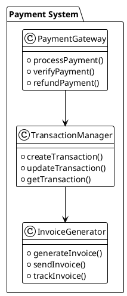
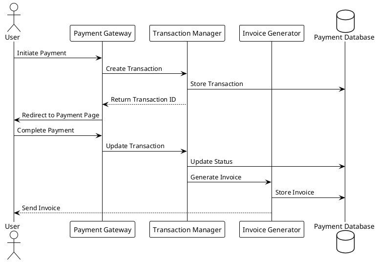
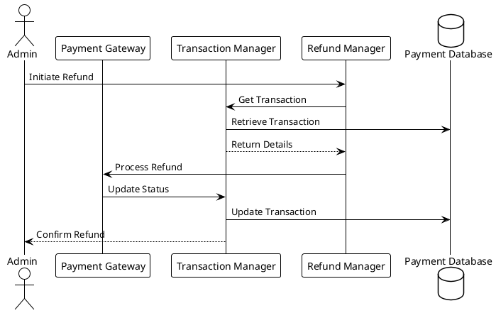

# Payment System Analysis

## Overview
This document analyzes the payment system of the LMS platform, its structure, and integration points.

## Payment System Structure

### Core Components

### Payment Flow

### Refund Flow

## Payment Gateways

### Supported Gateways
1. PayPal
   - Payment processing
   - Subscription handling
   - Refund processing
   - Webhook integration

2. Stripe
   - Payment processing
   - Subscription handling
   - Refund processing
   - Webhook integration

3. Razorpay
   - Payment processing
   - Subscription handling
   - Refund processing
   - Webhook integration

4. Skrill
   - Payment processing
   - Subscription handling
   - Refund processing
   - Webhook integration

5. PayU
   - Payment processing
   - Subscription handling
   - Refund processing
   - Webhook integration

### Gateway Integration
1. Configuration
   - API credentials
   - Webhook URLs
   - Test mode settings
   - Currency settings

2. Processing
   - Payment initiation
   - Status verification
   - Error handling
   - Retry logic

3. Webhooks
   - Event handling
   - Status updates
   - Error logging
   - Notification sending

## Transaction Management

### Transaction Types
1. Payment
   - Course purchase
   - Subscription payment
   - Bundle purchase
   - Addon purchase

2. Refund
   - Full refund
   - Partial refund
   - Subscription cancellation
   - Bundle refund

3. Subscription
   - Monthly subscription
   - Annual subscription
   - Trial subscription
   - Upgrade/downgrade

### Transaction States
1. Initial States
   - Pending
   - Processing
   - Completed
   - Failed

2. Refund States
   - Refund requested
   - Refund processing
   - Refund completed
   - Refund failed

3. Subscription States
   - Active
   - Paused
   - Cancelled
   - Expired

## Invoice Management

### Invoice Generation
1. Template System
   - HTML templates
   - PDF generation
   - Email templates
   - Customization options

2. Data Integration
   - User information
   - Course details
   - Payment information
   - Tax calculations

3. Delivery Methods
   - Email delivery
   - PDF download
   - API access
   - Web interface

### Invoice Tracking
1. Status Monitoring
   - Generation status
   - Delivery status
   - View status
   - Download status

2. Analytics
   - Generation metrics
   - Delivery metrics
   - View metrics
   - Download metrics

3. Reporting
   - Invoice reports
   - Payment reports
   - Tax reports
   - Revenue reports

## Security Measures

### Payment Security
1. Data Encryption
   - Card data
   - Personal information
   - Transaction details
   - API credentials

2. Fraud Prevention
   - IP tracking
   - Device fingerprinting
   - Velocity checks
   - Risk scoring

3. Compliance
   - PCI DSS
   - GDPR
   - Local regulations
   - Industry standards

### Transaction Security
1. Verification
   - Amount verification
   - Currency verification
   - User verification
   - Gateway verification

2. Audit Trail
   - Transaction logging
   - Status changes
   - User actions
   - System events

3. Error Handling
   - Validation errors
   - Processing errors
   - Gateway errors
   - System errors

## Integration Points

### System Integration
1. User System
   - User authentication
   - Profile information
   - Access control
   - Activity tracking

2. Course System
   - Course access
   - Enrollment management
   - Progress tracking
   - Completion handling

3. Notification System
   - Payment notifications
   - Invoice notifications
   - Refund notifications
   - Subscription notifications

### External Integration
1. Accounting Systems
   - Transaction export
   - Invoice export
   - Tax reporting
   - Revenue tracking

2. CRM Systems
   - Customer data
   - Transaction history
   - Communication history
   - Support tickets

3. Analytics Systems
   - Payment analytics
   - Revenue analytics
   - User analytics
   - Course analytics 