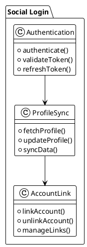
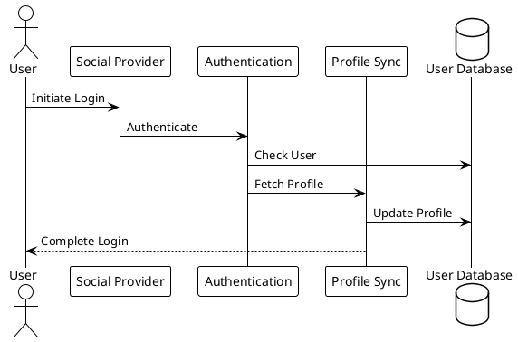
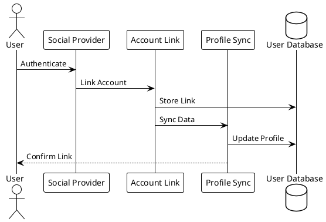

# Social Login System Analysis

## Overview
This document analyzes the social login system of the LMS platform, its structure, and integration points.

## Social Login Structure

### Core Components

### Authentication Flow

### Account Linking

## Supported Providers

### Social Platforms
1. Facebook
   - OAuth 2.0
   - Profile data
   - Email access
   - Friends list

2. Google
   - OAuth 2.0
   - Profile data
   - Email access
   - Calendar access

3. Twitter
   - OAuth 1.0a
   - Profile data
   - Email access
   - Timeline access

4. LinkedIn
   - OAuth 2.0
   - Profile data
   - Email access
   - Network data

5. GitHub
   - OAuth 2.0
   - Profile data
   - Email access
   - Repository access

### Integration Points
1. Authentication
   - OAuth flow
   - Token management
   - Session handling
   - Error handling

2. Profile Data
   - Data mapping
   - Field validation
   - Data transformation
   - Storage strategy

3. Permissions
   - Scope management
   - Consent handling
   - Permission tracking
   - Revocation handling

## Profile Management

### Data Synchronization
1. Profile Fields
   - Name
   - Email
   - Photo
   - Location

2. Additional Data
   - Social connections
   - Interests
   - Skills
   - Education

3. Custom Fields
   - User preferences
   - System settings
   - Course preferences
   - Notification settings

### Account Linking
1. Link Management
   - Multiple providers
   - Primary account
   - Link status
   - Unlink handling

2. Data Merging
   - Conflict resolution
   - Data priority
   - Field mapping
   - Update strategy

3. Security
   - Link verification
   - Access control
   - Token management
   - Session handling

## Security Measures

### Authentication Security
1. Token Security
   - Token encryption
   - Token expiration
   - Refresh tokens
   - Token validation

2. OAuth Security
   - State validation
   - CSRF protection
   - Scope validation
   - Client validation

3. Session Security
   - Session encryption
   - Session timeout
   - IP validation
   - Device tracking

### Data Security
1. Profile Data
   - Data encryption
   - Access control
   - Data validation
   - Audit logging

2. Account Data
   - Link encryption
   - Access control
   - Activity logging
   - Security alerts

3. Compliance
   - GDPR
   - Privacy laws
   - Data protection
   - User consent

## Integration Points

### System Integration
1. User System
   - User creation
   - Profile management
   - Authentication
   - Authorization

2. Course System
   - Enrollment
   - Progress tracking
   - Completion handling
   - Certificate generation

3. Notification System
   - Welcome messages
   - Account updates
   - Security alerts
   - System notifications

### External Integration
1. Social Platforms
   - API integration
   - Webhook handling
   - Data synchronization
   - Error handling

2. Analytics Systems
   - Login analytics
   - User behavior
   - Conversion tracking
   - Engagement metrics

3. Marketing Tools
   - User segmentation
   - Campaign tracking
   - Lead generation
   - Conversion optimization

## Error Handling

### Authentication Errors
1. Provider Errors
   - API errors
   - Network errors
   - Rate limiting
   - Service downtime

2. Validation Errors
   - Token validation
   - Profile validation
   - Permission validation
   - Scope validation

3. System Errors
   - Database errors
   - Cache errors
   - Session errors
   - Configuration errors

### Recovery Procedures
1. Error Recovery
   - Retry logic
   - Fallback options
   - Error logging
   - Alert system

2. User Recovery
   - Error messages
   - Help resources
   - Support contact
   - Alternative login

3. System Recovery
   - Backup systems
   - Failover handling
   - Data recovery
   - Service restoration 