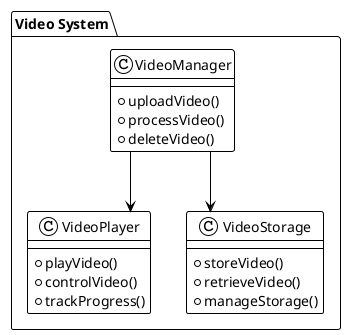
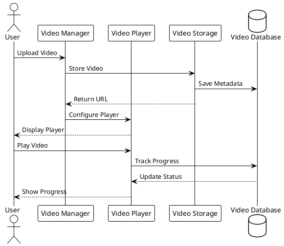
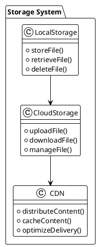

# Video System Analysis

## Overview
This document analyzes the video system of the LMS platform, its structure, and integration points.

## Video System Structure

### Core Components

### Video Flow

### Storage System

## Video Processing

### Upload Process
1. File Validation
   - Format checking
   - Size validation
   - Duration checking
   - Quality assessment

2. Processing
   - Format conversion
   - Quality optimization
   - Thumbnail generation
   - Metadata extraction

3. Storage
   - File organization
   - Backup creation
   - Access control
   - Version management

### Playback Process
1. Player Configuration
   - Player settings
   - Quality options
   - Control options
   - Theme settings

2. Streaming
   - Adaptive bitrate
   - Quality switching
   - Buffer management
   - Error handling

3. Progress Tracking
   - View tracking
   - Progress saving
   - Completion tracking
   - Analytics collection

## Storage Options

### Local Storage
1. File System
   - Directory structure
   - File naming
   - Access control
   - Backup strategy

2. Database
   - Metadata storage
   - Progress tracking
   - User data
   - Analytics data

3. Cache
   - Temporary storage
   - Performance optimization
   - Resource management
   - Cleanup strategy

### Cloud Storage
1. Storage Services
   - Amazon S3
   - Google Cloud Storage
   - Azure Blob Storage
   - Custom storage

2. CDN Integration
   - CloudFront
   - Cloudflare
   - Akamai
   - Custom CDN

3. Backup Services
   - Automated backup
   - Version control
   - Disaster recovery
   - Data redundancy

## Player Features

### Core Features
1. Playback
   - Play/pause
   - Seek
   - Speed control
   - Quality selection

2. Controls
   - Volume control
   - Fullscreen
   - Picture-in-picture
   - Keyboard shortcuts

3. UI Elements
   - Progress bar
   - Time display
   - Quality selector
   - Download button

### Advanced Features
1. Analytics
   - View tracking
   - Engagement metrics
   - Quality metrics
   - Error tracking

2. Accessibility
   - Closed captions
   - Audio descriptions
   - Keyboard navigation
   - Screen reader support

3. Interactivity
   - Comments
   - Bookmarks
   - Notes
   - Quizzes

## Integration Points

### System Integration
1. Course System
   - Video embedding
   - Progress tracking
   - Completion handling
   - Analytics integration

2. User System
   - Access control
   - Progress tracking
   - Preferences
   - History tracking

3. Analytics System
   - View analytics
   - Engagement metrics
   - Performance data
   - User behavior

### External Integration
1. Video Services
   - YouTube
   - Vimeo
   - Wistia
   - Custom service

2. Storage Services
   - Cloud storage
   - CDN services
   - Backup services
   - Archive services

3. Analytics Services
   - Video analytics
   - User analytics
   - Performance analytics
   - Engagement analytics

## Security Measures

### Video Security
1. Access Control
   - Authentication
   - Authorization
   - IP restriction
   - Domain restriction

2. Encryption
   - Content encryption
   - DRM protection
   - Secure streaming
   - Token protection

3. Watermarking
   - Visible watermark
   - Invisible watermark
   - Dynamic watermark
   - Custom watermark

### Storage Security
1. Data Protection
   - Encryption at rest
   - Encryption in transit
   - Access logging
   - Audit trail

2. Backup Security
   - Secure backup
   - Version control
   - Disaster recovery
   - Data redundancy

3. Compliance
   - GDPR
   - Copyright laws
   - Local regulations
   - Industry standards 