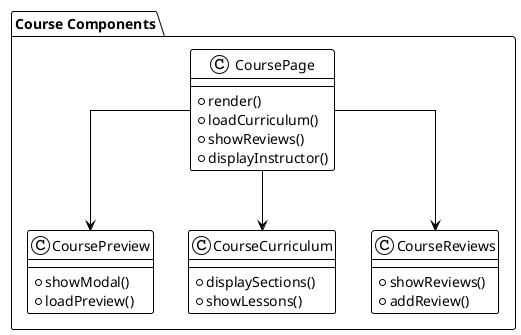
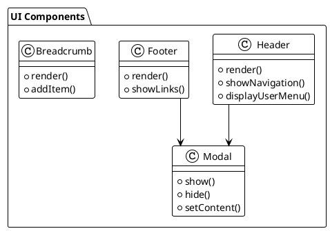

# View Analysis

## Overview
This document analyzes the frontend views of the LMS platform, their structure, and their role in the user interface.

## View Structure

### Layout Components
1. Header
   - `header.php`: Main header
   - `logged_in_header.php`: Header for logged-in users
   - `logged_out_header.php`: Header for logged-out users
   - `header_lg_device.php`: Header for large devices
   - `header_sm_device.php`: Header for small devices

2. Footer
   - `footer.php`: Main footer
   - `includes_bottom.php`: Bottom includes
   - `includes_top.php`: Top includes

3. Common Components
   - `breadcrumb.php`: Navigation breadcrumbs
   - `modal.php`: Modal dialogs
   - `common_scripts.php`: Common JavaScript
   - `menu.php`: Navigation menu

### Page Types

#### Home Pages
- `home.php`: Default home page
- `home_1.php` to `home_7.php`: Alternative home page layouts
- `home_4.php`, `home_5.php`, `home_6.php`: Additional home page variations

#### Course Pages
- `course_page.php`: Main course page
- `course_page_preview_modal.php`: Course preview modal
- `course_page_info_description.php`: Course description
- `course_page_instructor.php`: Instructor information
- `course_page_reviews.php`: Course reviews
- `course_page_curriculum.php`: Course curriculum

#### User Pages
- `user_profile.php`: User profile
- `my_courses.php`: User's courses
- `my_wishlist.php`: User's wishlist
- `my_messages.php`: User's messages
- `notifications.php`: User notifications
- `purchase_history.php`: Purchase history
- `shopping_cart.php`: Shopping cart
- `shopping_cart_inner_view.php`: Cart items view

#### Authentication Pages
- `login.php`: Login page
- `sign_up.php`: Registration page
- `forgot_password.php`: Password recovery
- `change_password_from_forgot_password.php`: Password change
- `verification_code.php`: Email verification
- `new_login_confirmation.php`: Login confirmation

#### Blog Pages
- `blogs.php`: Blog listing
- `blog_details.php`: Blog post details
- `blog_categories.php`: Blog categories
- `blog_sidebar.php`: Blog sidebar
- `blog_latest_and_popular.php`: Latest and popular posts

#### Static Pages
- `about_us.php`: About page
- `contact_us.php`: Contact page
- `privacy_policy.php`: Privacy policy
- `terms_and_condition.php`: Terms and conditions
- `refund_policy.php`: Refund policy
- `website_faq.php`: FAQ page

## Component Structure

### Course Components

### User Interface Components

## Vue 3 Migration Strategy

### Component Structure
1. Layout Components
   - Header component
   - Footer component
   - Navigation component
   - Modal component

2. Course Components
   - Course list component
   - Course detail component
   - Course curriculum component
   - Course review component

3. User Components
   - Profile component
   - Dashboard component
   - Course management component
   - Notification component

4. Authentication Components
   - Login component
   - Registration component
   - Password recovery component
   - Verification component

### State Management
1. Vuex Store Modules
   - User module
   - Course module
   - Cart module
   - Notification module

2. State Structure
   - User state
   - Course state
   - UI state
   - Authentication state

### Routing
1. Route Structure
   - Public routes
   - Protected routes
   - Admin routes
   - Instructor routes

2. Route Guards
   - Authentication guard
   - Role guard
   - Course access guard

### API Integration
1. API Services
   - User service
   - Course service
   - Payment service
   - Notification service

2. API Configuration
   - Base URL
   - Headers
   - Interceptors
   - Error handling

## Modularization Strategy

### Component Organization
1. Core Components
   - Layout components
   - UI components
   - Form components

2. Feature Components
   - Course components
   - User components
   - Payment components

3. Shared Components
   - Common components
   - Utility components
   - Service components

### Style Organization
1. Global Styles
   - Variables
   - Mixins
   - Utilities

2. Component Styles
   - Scoped styles
   - Module styles
   - Theme styles

### Asset Management
1. Static Assets
   - Images
   - Fonts
   - Icons

2. Dynamic Assets
   - Course content
   - User uploads
   - Generated content 