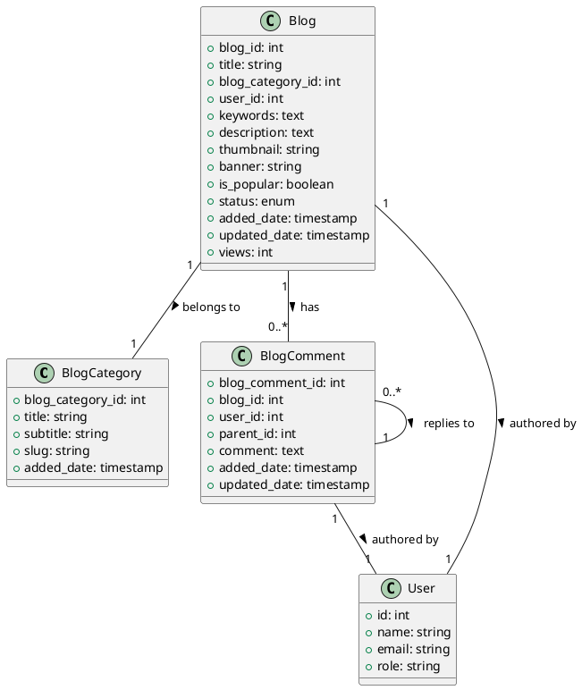

# Blog Model Documentation

## Overview
The Blog model is a core component of the LMS platform that handles blog management, including categories, posts, comments, and related functionality. It provides features for creating, updating, and managing blog content, with support for multiple authors, categories, and moderation.

## Database Schema

### Blog Categories Table
```sql
CREATE TABLE blog_category (
    blog_category_id INT PRIMARY KEY AUTO_INCREMENT,
    title VARCHAR(255),
    subtitle TEXT,
    slug VARCHAR(255),
    added_date TIMESTAMP,
    UNIQUE KEY unique_slug (slug)
);
```

### Blogs Table
```sql
CREATE TABLE blogs (
    blog_id INT PRIMARY KEY AUTO_INCREMENT,
    title VARCHAR(255),
    blog_category_id INT,
    user_id INT,
    keywords TEXT,
    description LONGTEXT,
    thumbnail VARCHAR(255),
    banner VARCHAR(255),
    is_popular BOOLEAN DEFAULT FALSE,
    status ENUM('pending', 'active', 'inactive') DEFAULT 'pending',
    added_date TIMESTAMP,
    updated_date TIMESTAMP,
    views INT DEFAULT 0,
    FOREIGN KEY (blog_category_id) REFERENCES blog_category(blog_category_id),
    FOREIGN KEY (user_id) REFERENCES users(id)
);
```

### Blog Comments Table
```sql
CREATE TABLE blog_comments (
    blog_comment_id INT PRIMARY KEY AUTO_INCREMENT,
    blog_id INT,
    user_id INT,
    parent_id INT DEFAULT 0,
    comment TEXT,
    added_date TIMESTAMP,
    updated_date TIMESTAMP,
    FOREIGN KEY (blog_id) REFERENCES blogs(blog_id),
    FOREIGN KEY (user_id) REFERENCES users(id),
    FOREIGN KEY (parent_id) REFERENCES blog_comments(blog_comment_id)
);
```

## Core Methods

### Category Management
- `add_blog_category()`: Creates a new blog category
- `update_blog_category($blog_category_id)`: Updates an existing category
- `delete_blog_category($blog_category_id)`: Removes a category
- `get_blog_categories($blog_category_id)`: Retrieves categories
- `get_blog_category_by_slug($category_slug)`: Gets category by slug
- `get_categories_with_blog_number($limit)`: Gets categories with post counts

### Blog Management
- `add_blog()`: Creates a new blog post
- `update_blog($blog_id)`: Updates an existing post
- `blog_delete($blog_id)`: Removes a blog post
- `get_blogs($blog_id)`: Gets all non-pending posts
- `get_active_blogs($blog_id)`: Gets active posts
- `get_popular_blogs($limit)`: Gets popular posts
- `get_latest_blogs($limit)`: Gets recent posts
- `get_blogs_by_category_id($blog_category_id)`: Gets posts by category
- `get_blogs_by_user_id($user_id, $status)`: Gets posts by author

### Comment Management
- `add_blog_comment($blog_id, $user_id)`: Adds a comment
- `update_blog_comment($blog_comment_id, $user_id)`: Updates a comment
- `delete_comment($blog_comment_id, $user_id)`: Removes a comment
- `get_blog_comments_by_blog_id($blog_id)`: Gets post comments
- `get_blog_comments_by_parent_id($parent_id)`: Gets comment replies

### Moderation
- `update_blog_status($blog_id)`: Updates post status
- `approve_blog($blog_id)`: Approves a pending post
- `get_instructors_pending_blog($user_id)`: Gets pending posts
- `update_blog_settings()`: Updates blog settings

## Data Structures

### Blog Category Data
```php
$category_data = [
    'title' => string,
    'subtitle' => string,
    'slug' => string,
    'added_date' => timestamp
];
```

### Blog Post Data
```php
$blog_data = [
    'title' => string,
    'blog_category_id' => int,
    'keywords' => string,
    'description' => text,
    'user_id' => int,
    'is_popular' => boolean,
    'status' => enum('pending', 'active', 'inactive'),
    'added_date' => timestamp
];
```

### Comment Data
```php
$comment_data = [
    'comment' => text,
    'parent_id' => int,
    'blog_id' => int,
    'user_id' => int,
    'added_date' => timestamp
];
```

## Security Features
- Input sanitization
- XSS prevention
- User authorization
- Comment moderation
- Content validation
- Role-based access

## Integration Points
- User system
- File storage system
- Notification system
- Search system
- SEO system
- Analytics system

## Migration Considerations
1. Implement proper validation
2. Add proper error handling
3. Implement proper logging
4. Add proper events
5. Create proper repositories
6. Add proper services

## Testing Requirements
1. Category management tests
2. Blog post management tests
3. Comment management tests
4. Moderation tests
5. Security tests
6. Integration tests

## PlantUML Diagram


## Best Practices
1. Always validate input data
2. Implement proper caching
3. Use SEO-friendly URLs
4. Implement proper pagination
5. Handle media files properly
6. Implement proper search

## Usage Examples

### Creating a Blog Post
```php
$blog_data = [
    'title' => 'Sample Blog Post',
    'blog_category_id' => 1,
    'keywords' => 'sample, test, blog',
    'description' => 'This is a sample blog post',
    'is_popular' => false
];
$this->crud_model->add_blog();
```

### Managing Comments
```php
// Add comment
$this->crud_model->add_blog_comment($blog_id, $user_id);

// Update comment
$this->crud_model->update_blog_comment($comment_id, $user_id);

// Delete comment
$this->crud_model->delete_comment($comment_id, $user_id);
```

### Category Management
```php
// Add category
$this->crud_model->add_blog_category();

// Update category
$this->crud_model->update_blog_category($category_id);

// Delete category
$this->crud_model->delete_blog_category($category_id);
``` 