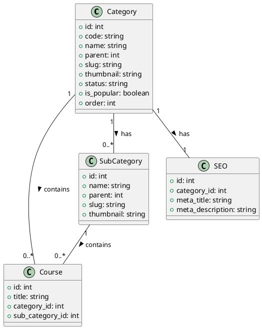

# Category Model Documentation

## Overview
The Category model is a core component of the LMS platform that handles course categorization. It provides functionality for creating, updating, and managing course categories and subcategories, enabling efficient course organization and discovery.

## Database Schema

### Categories Table
```sql
CREATE TABLE categories (
    id INT PRIMARY KEY AUTO_INCREMENT,
    code VARCHAR(50),
    name VARCHAR(255),
    parent INT DEFAULT 0,
    slug VARCHAR(255),
    date_added TIMESTAMP,
    last_modified TIMESTAMP,
    font_awesome_class VARCHAR(255),
    thumbnail VARCHAR(255),
    sub_category_thumbnail VARCHAR(255),
    status VARCHAR(50),
    is_popular BOOLEAN,
    order INT,
    meta_keywords TEXT,
    meta_description TEXT,
    total_courses INT,
    total_subcategories INT,
    total_enrollments INT,
    total_revenue DECIMAL(10,2),
    featured BOOLEAN,
    show_on_header BOOLEAN,
    color_code VARCHAR(50),
    icon_picker VARCHAR(255),
    banner_image VARCHAR(255),
    banner_title VARCHAR(255),
    banner_subtitle TEXT,
    seo_title VARCHAR(255),
    seo_description TEXT,
    og_title VARCHAR(255),
    og_description TEXT,
    og_image VARCHAR(255),
    twitter_title VARCHAR(255),
    twitter_description TEXT,
    twitter_image VARCHAR(255)
);
```

## Core Methods

### Category Management
- `get_categories($param1)`: Retrieves categories
- `get_category_details_by_id($id)`: Gets category details
- `get_category_id($slug)`: Gets category by slug
- `add_category()`: Creates new category
- `edit_category($param1)`: Updates category
- `delete_category($category_id)`: Removes category

### Subcategory Management
- `get_sub_categories($parent_id)`: Gets subcategories
- `add_sub_category()`: Creates subcategory
- `edit_sub_category()`: Updates subcategory
- `delete_sub_category()`: Removes subcategory
- `get_sub_category_details()`: Gets subcategory details

### Course Management
- `get_category_wise_courses($category_id)`: Gets courses by category
- `get_active_course_by_category_id($category_id)`: Gets active courses
- `get_top_categories($limit)`: Gets popular categories
- `get_categories_with_course_number($limit)`: Gets category statistics

## Data Structures

### Category Data
```php
$category_data = [
    'code' => string,
    'name' => string,
    'parent' => int,
    'slug' => string,
    'font_awesome_class' => string,
    'thumbnail' => string,
    'status' => string,
    'is_popular' => boolean,
    'order' => int,
    'meta_keywords' => string,
    'meta_description' => string
];
```

### Subcategory Data
```php
$subcategory_data = [
    'name' => string,
    'parent' => int,
    'slug' => string,
    'thumbnail' => string,
    'status' => string,
    'order' => int
];
```

## Security Features
- Input validation
- Slug generation
- File upload validation
- Access control
- Data sanitization
- Error handling

## Integration Points
- Course system
- Search system
- Navigation system
- SEO system
- Analytics system
- Frontend system
- API system

## Migration Considerations
1. Implement proper validation
2. Add proper error handling
3. Implement proper logging
4. Add proper events
5. Create proper repositories
6. Add proper services

## Testing Requirements
1. Category creation tests
2. Category update tests
3. Category deletion tests
4. Subcategory management tests
5. Course association tests
6. Slug generation tests
7. File upload tests

## PlantUML Diagram


## Best Practices
1. Use meaningful category names
2. Maintain proper hierarchy
3. Generate SEO-friendly slugs
4. Optimize category images
5. Cache category data
6. Monitor category usage
7. Regular cleanup

## Usage Examples

### Creating a Category
```php
$category_data = [
    'code' => 'PROG',
    'name' => 'Programming',
    'parent' => 0,
    'slug' => 'programming',
    'font_awesome_class' => 'fas fa-code',
    'thumbnail' => 'programming.jpg'
];
$this->add_category($category_data);
```

### Getting Category Courses
```php
$courses = $this->get_category_wise_courses($category_id);
```

### Managing Subcategories
```php
$subcategories = $this->get_sub_categories($parent_id);
``` 