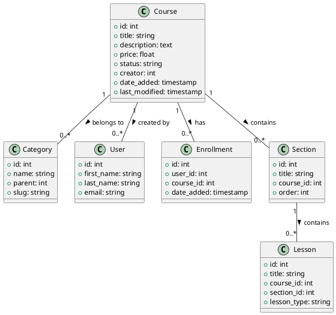

# Course Model Documentation

## Overview
The Course model is a core component of the LMS platform that handles course management, including creation, updating, deletion, and various course-related operations. While the main course functionality is handled in the Crud model, this documentation focuses on the course-specific aspects.

## Database Schema

### Courses Table
```sql
CREATE TABLE courses (
    id INT PRIMARY KEY AUTO_INCREMENT,
    title VARCHAR(255),
    short_description TEXT,
    description TEXT,
    outcomes JSON,
    language VARCHAR(50),
    category_id INT,
    sub_category_id INT,
    requirements JSON,
    price DECIMAL(10,2),
    discount_flag BOOLEAN,
    discounted_price DECIMAL(10,2),
    level VARCHAR(50),
    video_url VARCHAR(255),
    thumbnail VARCHAR(255),
    meta_keywords TEXT,
    meta_description TEXT,
    is_top_course BOOLEAN,
    status VARCHAR(50),
    creator INT,
    date_added TIMESTAMP,
    last_modified TIMESTAMP,
    course_type VARCHAR(50),
    is_free_course BOOLEAN,
    course_overview_provider VARCHAR(50),
    external_url VARCHAR(255),
    external_button_text VARCHAR(255),
    video_count INT,
    rating DECIMAL(3,2),
    number_of_ratings INT,
    number_of_enrolled_students INT,
    completion_rate INT,
    total_enrollment INT,
    total_lessons INT,
    total_duration INT,
    total_quiz INT,
    total_assignments INT,
    total_attachments INT,
    total_announcements INT,
    total_questions INT,
    total_reviews INT,
    total_comments INT,
    total_wishlist INT,
    total_views INT,
    total_likes INT,
    total_dislikes INT,
    total_shares INT,
    total_downloads INT,
    total_reports INT,
    total_flags INT,
    total_notes INT,
    total_bookmarks INT,
    total_highlights INT,
    total_annotations INT,
    total_quiz_attempts INT,
    total_quiz_passed INT,
    total_quiz_failed INT,
    total_quiz_in_progress INT,
    total_quiz_not_started INT,
    total_quiz_time_spent INT,
    total_quiz_score INT,
    total_quiz_percentage INT,
    total_quiz_questions INT,
    total_quiz_correct_answers INT,
    total_quiz_wrong_answers INT,
    total_quiz_skipped_questions INT,
    total_quiz_time_limit INT,
    total_quiz_passing_score INT,
    total_quiz_passing_percentage INT,
    total_quiz_max_attempts INT,
    total_quiz_current_attempt INT,
    total_quiz_last_attempt_date TIMESTAMP,
    total_quiz_next_attempt_date TIMESTAMP,
    total_quiz_last_score INT,
    total_quiz_last_percentage INT,
    total_quiz_last_status VARCHAR(50),
    total_quiz_last_time_spent INT,
    total_quiz_last_questions_attempted INT,
    total_quiz_last_correct_answers INT,
    total_quiz_last_wrong_answers INT,
    total_quiz_last_skipped_questions INT,
    total_quiz_last_time_limit INT,
    total_quiz_last_passing_score INT,
    total_quiz_last_passing_percentage INT,
    total_quiz_last_max_attempts INT,
    total_quiz_last_current_attempt INT,
    total_quiz_last_last_attempt_date TIMESTAMP,
    total_quiz_last_next_attempt_date TIMESTAMP
);
```

## Core Methods

### Course Management
- `add_course($param1)`: Creates a new course
- `update_course($course_id, $type)`: Updates course details
- `delete_course($course_id)`: Removes a course
- `get_course_by_id($course_id)`: Retrieves course details
- `change_course_status($status, $course_id)`: Updates course status

### Course Listing
- `get_my_courses_by_category_id($category_id)`: Gets courses by category
- `get_my_courses_by_search_string($search_string)`: Searches courses
- `get_courses_by_search_string($search_string, $per_page, $uri_segment)`: Searches with pagination
- `get_course_thumbnail_url($course_id, $type)`: Gets course thumbnail

### Enrollment Management
- `enrol_history($course_id, $distinct_data)`: Gets enrollment history
- `enrol_student($enrol_user_id, $payer_user_id)`: Enrolls a student
- `enrol_to_free_course($course_id, $user_id)`: Enrolls in free course
- `course_purchase($user_id, $method, $amount_paid)`: Handles course purchase

## Data Structures

### Course Data
```php
$course_data = [
    'title' => string,
    'short_description' => text,
    'description' => text,
    'outcomes' => array,
    'language' => string,
    'category_id' => int,
    'sub_category_id' => int,
    'requirements' => array,
    'price' => float,
    'discount_flag' => boolean,
    'discounted_price' => float,
    'level' => string,
    'video_url' => string,
    'thumbnail' => string,
    'meta_keywords' => string,
    'meta_description' => string,
    'is_top_course' => boolean,
    'status' => string
];
```

## Security Features
- Input validation
- Access control
- File upload validation
- Data sanitization
- Error handling

## Integration Points
- User system
- Payment system
- Category system
- Lesson system
- Section system
- Quiz system
- Enrollment system

## Migration Considerations
1. Implement proper validation
2. Add proper error handling
3. Implement proper logging
4. Add proper events
5. Create proper repositories
6. Add proper services

## Testing Requirements
1. Course creation tests
2. Course update tests
3. Course deletion tests
4. Course listing tests
5. Course search tests
6. Enrollment tests
7. Payment integration tests

## PlantUML Diagram
