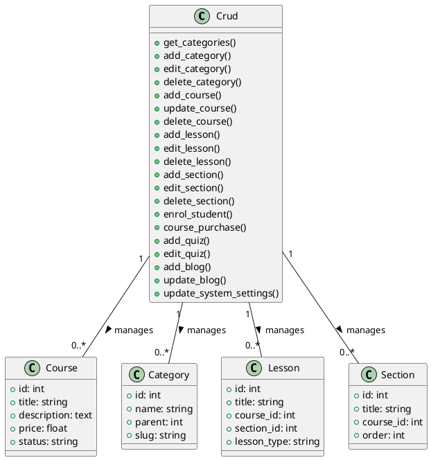

# Crud Model Documentation

## Overview
The Crud model is a core component of the LMS platform that handles basic CRUD operations and business logic for various entities. It extends the CI_Model class and provides comprehensive functionality for managing courses, categories, lessons, and other system components.

## Core Functionality

### Category Management
- `get_categories($param1)`: Retrieves categories
- `add_category()`: Creates new category
- `edit_category($param1)`: Updates category
- `delete_category($category_id)`: Removes category
- `get_sub_categories($parent_id)`: Gets subcategories

### Course Management
- `add_course($param1)`: Creates new course
- `update_course($course_id, $type)`: Updates course
- `delete_course($course_id)`: Removes course
- `get_course_by_id($course_id)`: Gets course details
- `get_courses_by_user_id($param1)`: Gets user's courses

### Lesson Management
- `add_lesson()`: Creates new lesson
- `edit_lesson($lesson_id)`: Updates lesson
- `delete_lesson($lesson_id)`: Removes lesson
- `get_lessons($type, $id)`: Gets lessons
- `get_default_lesson($section_id)`: Gets default lesson

### Section Management
- `add_section($course_id)`: Creates new section
- `edit_section($section_id)`: Updates section
- `delete_section($course_id, $section_id)`: Removes section
- `get_section($type_by, $id)`: Gets section
- `serialize_section($course_id, $serialization)`: Orders sections

### Enrollment Management
- `enrol_student($enrol_user_id, $payer_user_id)`: Enrolls student
- `enrol_a_student_manually()`: Manual enrollment
- `enrol_to_free_course($course_id, $user_id)`: Free course enrollment
- `course_purchase($user_id, $method, $amount_paid)`: Handles course purchase

### Quiz Management
- `add_quiz($course_id)`: Creates new quiz
- `edit_quiz($lesson_id)`: Updates quiz
- `get_quiz_questions($quiz_id)`: Gets quiz questions
- `manage_quiz_questions($quiz_id, $question_id, $action)`: Manages questions
- `delete_quiz_question($question_id)`: Removes question

### Blog Management
- `add_blog()`: Creates new blog
- `update_blog($blog_id)`: Updates blog
- `blog_delete($blog_id)`: Removes blog
- `get_blogs($blog_id)`: Gets blogs
- `get_active_blogs($blog_id)`: Gets active blogs

### System Settings
- `update_system_settings()`: Updates system settings
- `update_smtp_settings()`: Updates SMTP settings
- `update_payment_settings()`: Updates payment settings
- `update_instructor_settings()`: Updates instructor settings
- `update_frontend_settings()`: Updates frontend settings

## Data Structures

### Course Structure
```php
$course_data = [
    'title' => string,
    'short_description' => text,
    'description' => text,
    'outcomes' => array,
    'language' => string,
    'category_id' => int,
    'sub_category_id' => int,
    'requirements' => array,
    'price' => float,
    'discount_flag' => boolean,
    'discounted_price' => float,
    'level' => string,
    'video_url' => string,
    'thumbnail' => string,
    'meta_keywords' => string,
    'meta_description' => string,
    'is_top_course' => boolean,
    'status' => string
];
```

### Lesson Structure
```php
$lesson_data = [
    'title' => string,
    'section_id' => int,
    'course_id' => int,
    'lesson_type' => string,
    'attachment_type' => string,
    'attachment' => string,
    'summary' => text,
    'video_type' => string,
    'video_url' => string,
    'duration' => string,
    'order' => int
];
```

## Security Features
- Input sanitization
- File upload validation
- Access control checks
- Data validation
- Error handling

## Integration Points
- Course system
- Payment system
- User system
- File storage system
- Email system
- Blog system
- Quiz system

## Migration Considerations
1. Implement proper repository pattern
2. Add service layer
3. Create proper validation rules
4. Implement proper error handling
5. Add proper logging
6. Create proper events

## Testing Requirements
1. CRUD operations tests
2. Business logic tests
3. Validation tests
4. Integration tests
5. Security tests
6. Performance tests

## PlantUML Diagram
