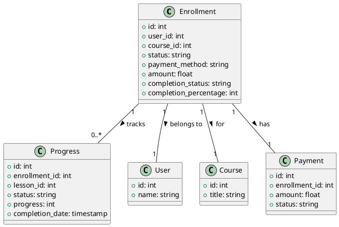

# Enrollment Model Documentation

## Overview
The Enrollment model is a core component of the LMS platform that handles student enrollment in courses. It provides functionality for managing course enrollments, tracking progress, and handling payment-related aspects of course enrollment.

## Database Schema

### Enrollments Table
```sql
CREATE TABLE enrollments (
    id INT PRIMARY KEY AUTO_INCREMENT,
    user_id INT,
    course_id INT,
    date_added TIMESTAMP,
    last_modified TIMESTAMP,
    status VARCHAR(50),
    payment_method VARCHAR(50),
    payment_id INT,
    amount DECIMAL(10,2),
    admin_revenue DECIMAL(10,2),
    instructor_revenue DECIMAL(10,2),
    tax DECIMAL(10,2),
    coupon_code VARCHAR(50),
    discount_amount DECIMAL(10,2),
    expiry_date TIMESTAMP,
    completion_status VARCHAR(50),
    completion_percentage INT,
    completion_date TIMESTAMP,
    last_access_date TIMESTAMP,
    total_time_spent INT,
    total_lessons_completed INT,
    total_quizzes_completed INT,
    total_assignments_completed INT,
    total_discussions_participated INT,
    total_notes_created INT,
    total_bookmarks_created INT,
    total_highlights_created INT,
    total_annotations_created INT,
    total_downloads INT,
    total_views INT,
    total_ratings INT,
    average_rating DECIMAL(3,2),
    certificate_issued BOOLEAN,
    certificate_url VARCHAR(255),
    certificate_date TIMESTAMP,
    refund_status VARCHAR(50),
    refund_amount DECIMAL(10,2),
    refund_date TIMESTAMP,
    refund_reason TEXT,
    refund_notes TEXT,
    gift_user_id INT,
    gift_message TEXT,
    gift_date TIMESTAMP
);

CREATE TABLE enrollment_progress (
    id INT PRIMARY KEY AUTO_INCREMENT,
    enrollment_id INT,
    lesson_id INT,
    quiz_id INT,
    assignment_id INT,
    status VARCHAR(50),
    progress INT,
    start_date TIMESTAMP,
    completion_date TIMESTAMP,
    total_time_spent INT,
    last_access_date TIMESTAMP,
    notes TEXT,
    quiz_score INT,
    quiz_attempts INT,
    assignment_score INT,
    assignment_feedback TEXT
);
```

## Core Methods

### Enrollment Management
- `enrol_student($enrol_user_id, $payer_user_id)`: Enrolls student
- `enrol_history($course_id, $distinct_data)`: Gets enrollment history
- `enrol_history_by_user_id($user_id)`: Gets user enrollments
- `enrol_history_by_date_range($start, $end)`: Gets date range enrollments
- `delete_enrol_history($param1)`: Removes enrollment

### Progress Tracking
- `get_lesson_progress($lesson_id)`: Tracks lesson progress
- `get_course_progress($course_id)`: Tracks course progress
- `update_watch_history()`: Updates lesson viewing
- `mark_lesson_completed()`: Completes lesson
- `update_last_played_lesson()`: Updates current lesson

### Payment Management
- `course_purchase($user_id, $method, $amount)`: Handles purchase
- `get_revenue_by_user_type($start, $end)`: Gets revenue stats
- `get_instructor_revenue($user_id)`: Gets instructor revenue
- `delete_payment_history($param1)`: Removes payment record
- `purchase_history($user_id)`: Gets purchase history

## Data Structures

### Enrollment Data
```php
$enrollment_data = [
    'user_id' => int,
    'course_id' => int,
    'status' => string,
    'payment_method' => string,
    'payment_id' => int,
    'amount' => float,
    'admin_revenue' => float,
    'instructor_revenue' => float,
    'tax' => float,
    'coupon_code' => string,
    'discount_amount' => float,
    'expiry_date' => timestamp
];
```

### Progress Data
```php
$progress_data = [
    'enrollment_id' => int,
    'lesson_id' => int,
    'quiz_id' => int,
    'assignment_id' => int,
    'status' => string,
    'progress' => int,
    'start_date' => timestamp,
    'completion_date' => timestamp,
    'total_time_spent' => int
];
```

## Security Features
- Payment validation
- Access control
- Progress validation
- Data sanitization
- Error handling
- Fraud prevention

## Integration Points
- Course system
- User system
- Payment system
- Progress tracking
- Certificate system
- Notification system
- Analytics system

## Migration Considerations
1. Implement proper validation
2. Add proper error handling
3. Implement proper logging
4. Add proper events
5. Create proper repositories
6. Add proper services

## Testing Requirements
1. Enrollment creation tests
2. Progress tracking tests
3. Payment handling tests
4. Access control tests
5. Progress validation tests
6. Integration tests
7. Performance tests

## PlantUML Diagram


## Best Practices
1. Validate enrollment data
2. Track progress accurately
3. Handle payments securely
4. Manage access control
5. Monitor enrollment status
6. Track completion rates
7. Handle refunds properly

## Usage Examples

### Enrolling a Student
```php
$enrollment_data = [
    'user_id' => 1,
    'course_id' => 1,
    'payment_method' => 'stripe',
    'amount' => 99.99
];
$this->enrol_student($enrollment_data['user_id']);
```

### Tracking Progress
```php
$progress = $this->get_course_progress($course_id, $user_id);
```

### Managing Payment
```php
$this->course_purchase($user_id, 'stripe', 99.99);
``` 