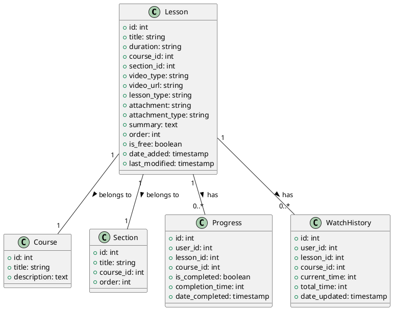

# Lesson Model Documentation

## Overview
The Lesson model is a core component of the LMS platform that handles lesson management within courses. It provides functionality for creating, updating, and managing course lessons, including various types of content like videos, documents, and quizzes.

## Database Schema

### Lessons Table
```sql
CREATE TABLE lessons (
    id INT PRIMARY KEY AUTO_INCREMENT,
    title VARCHAR(255),
    duration VARCHAR(50),
    course_id INT,
    section_id INT,
    video_type VARCHAR(255),
    video_url VARCHAR(255),
    lesson_type VARCHAR(50),
    attachment VARCHAR(255),
    attachment_type VARCHAR(50),
    summary TEXT,
    order INT,
    is_free BOOLEAN,
    date_added TIMESTAMP,
    last_modified TIMESTAMP,
    completion_time INT,
    is_completed BOOLEAN,
    video_type_for_mobile_application VARCHAR(50),
    video_url_for_mobile_application VARCHAR(255),
    duration_for_mobile_application VARCHAR(50)
);
```

## Core Methods

### Lesson Management
- `get_lessons($type, $id)`: Retrieves lessons by type (course/section/lesson)
- `add_lesson()`: Creates a new lesson
- `edit_lesson($lesson_id)`: Updates lesson details
- `delete_lesson($lesson_id)`: Removes a lesson
- `get_lesson_thumbnail_url($lesson_id)`: Gets lesson thumbnail
- `get_free_lessons($lesson_id)`: Gets free lessons

### Lesson Progress
- `lesson_progress($lesson_id, $user_id)`: Tracks lesson completion
- `update_watch_history_manually($lesson_id, $course_id, $user_id)`: Updates watch history
- `update_last_played_lesson($course_id, $lesson_id)`: Updates last played lesson
- `get_watch_histories($user_id, $course_id)`: Gets watch history

### Lesson Types
- Video (YouTube, Vimeo, HTML5)
- Document (PDF)
- Quiz
- Text
- Image
- IFrame
- External Source

## Data Structures

### Lesson Data
```php
$lesson_data = [
    'title' => string,
    'duration' => string,
    'course_id' => int,
    'section_id' => int,
    'video_type' => string,
    'video_url' => string,
    'lesson_type' => string,
    'attachment' => string,
    'attachment_type' => string,
    'summary' => text,
    'order' => int,
    'is_free' => boolean
];
```

## Security Features
- File upload validation
- Video URL validation
- Access control
- Progress tracking
- Error handling

## Integration Points
- Course system
- Section system
- User system
- Progress tracking system
- Video platform integration
- File storage system

## Migration Considerations
1. Implement proper validation
2. Add proper error handling
3. Implement proper logging
4. Add proper events
5. Create proper repositories
6. Add proper services

## Testing Requirements
1. Lesson creation tests
2. Lesson update tests
3. Lesson deletion tests
4. Progress tracking tests
5. File upload tests
6. Video integration tests
7. Access control tests

## PlantUML Diagram
