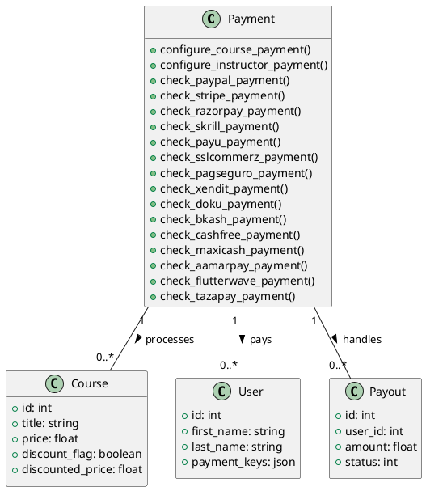

# Payment Model Documentation

## Overview
The Payment model handles all payment-related functionality in the LMS platform, including course purchases, instructor payouts, and integration with multiple payment gateways. It extends the CI_Model class and provides comprehensive payment processing capabilities.

## Supported Payment Gateways
1. PayPal
2. Stripe
3. Razorpay
4. Skrill
5. PayU
6. SSLCommerz
7. PagSeguro
8. Xendit
9. Doku
10. bKash
11. Cashfree
12. Maxicash
13. Aamarpay
14. Flutterwave
15. Tazapay

## Core Methods

### Payment Configuration
- `configure_course_payment()`: Sets up course purchase payment
- `configure_instructor_payment($is_instructor_payout_user_id)`: Sets up instructor payout

### Payment Gateway Integration
- `check_paypal_payment($identifier)`: Verifies PayPal payments
- `check_stripe_payment($identifier)`: Verifies Stripe payments
- `check_razorpay_payment($identifier)`: Verifies Razorpay payments
- `check_skrill_payment($identifier)`: Verifies Skrill payments
- `check_payu_payment($identifier)`: Verifies PayU payments
- `check_sslcommerz_payment($identifier)`: Verifies SSLCommerz payments
- `check_pagseguro_payment($identifier)`: Verifies PagSeguro payments
- `check_xendit_payment($identifier)`: Verifies Xendit payments
- `check_doku_payment($identifier)`: Verifies Doku payments
- `check_bkash_payment($identifier)`: Verifies bKash payments
- `check_cashfree_payment($identifier)`: Verifies Cashfree payments
- `check_maxicash_payment($identifier)`: Verifies Maxicash payments
- `check_aamarpay_payment($identifier)`: Verifies Aamarpay payments
- `check_flutterwave_payment($identifier)`: Verifies Flutterwave payments
- `check_tazapay_payment()`: Verifies Tazapay payments

## Data Structures

### Payment Details
```php
$payment_details = [
    'total_payable_amount' => float,
    'items' => array,
    'is_instructor_payout_user_id' => int|false,
    'payment_title' => string,
    'success_url' => string,
    'cancel_url' => string,
    'back_url' => string
];
```

### Item Structure
```php
$item_details = [
    'id' => int,
    'title' => string,
    'thumbnail' => string,
    'creator_id' => int,
    'discount_flag' => boolean,
    'discounted_price' => float,
    'price' => float,
    'actual_price' => float,
    'sub_items' => array
];
```

## Security Features
- Payment verification for each gateway
- Transaction amount validation
- Order status confirmation
- Duplicate payment prevention
- IPN (Instant Payment Notification) handling

## Integration Points
- Course purchase system
- Instructor payout system
- Coupon system
- Tax calculation
- User wallet system

## Migration Considerations
1. Implement proper payment gateway service providers
2. Add webhook controllers for each gateway
3. Create payment events and listeners
4. Implement proper error handling
5. Add transaction logging
6. Implement proper refund handling

## Testing Requirements
1. Payment gateway integration tests
2. Course purchase flow tests
3. Instructor payout tests
4. Coupon application tests
5. Tax calculation tests
6. Error handling tests
7. Security verification tests

## PlantUML Diagram
