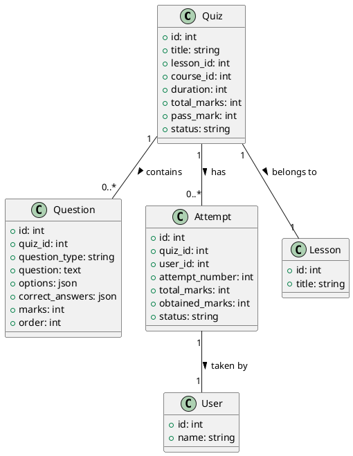

# Quiz Model Documentation

## Overview
The Quiz model is a core component of the LMS platform that handles quiz management within lessons. It provides functionality for creating, updating, and managing quizzes, questions, and student attempts. The model supports multiple question types and comprehensive quiz settings.

## Database Schema

### Quizzes Table
```sql
CREATE TABLE quizzes (
    id INT PRIMARY KEY AUTO_INCREMENT,
    title VARCHAR(255),
    lesson_id INT,
    course_id INT,
    duration INT,
    total_marks INT,
    pass_mark INT,
    questions_per_attempt INT,
    random_questions BOOLEAN,
    status VARCHAR(50),
    date_added TIMESTAMP,
    last_modified TIMESTAMP,
    show_results BOOLEAN,
    show_correct_answers BOOLEAN,
    shuffle_questions BOOLEAN,
    shuffle_options BOOLEAN,
    multiple_attempts BOOLEAN,
    max_attempts INT,
    passing_percentage INT,
    time_between_attempts INT,
    total_questions INT,
    total_attempts INT,
    total_passed INT,
    total_failed INT,
    average_score DECIMAL(5,2),
    completion_rate INT,
    difficulty_level VARCHAR(50),
    feedback_type VARCHAR(50),
    feedback_options JSON,
    grading_method VARCHAR(50),
    penalty_per_attempt INT,
    review_options JSON,
    certificate_eligibility BOOLEAN
);

CREATE TABLE quiz_questions (
    id INT PRIMARY KEY AUTO_INCREMENT,
    quiz_id INT,
    question_type VARCHAR(50),
    question TEXT,
    options JSON,
    correct_answers JSON,
    marks INT,
    explanation TEXT,
    order INT,
    status VARCHAR(50),
    difficulty_level VARCHAR(50),
    tags JSON,
    category VARCHAR(50),
    feedback JSON,
    time_limit INT,
    partial_grading BOOLEAN,
    case_sensitive BOOLEAN,
    date_added TIMESTAMP,
    last_modified TIMESTAMP
);

CREATE TABLE quiz_attempts (
    id INT PRIMARY KEY AUTO_INCREMENT,
    quiz_id INT,
    user_id INT,
    lesson_id INT,
    course_id INT,
    attempt_number INT,
    start_time TIMESTAMP,
    end_time TIMESTAMP,
    total_time INT,
    total_marks INT,
    obtained_marks INT,
    status VARCHAR(50),
    answers JSON,
    feedback JSON,
    review_status VARCHAR(50),
    ip_address VARCHAR(50),
    user_agent TEXT,
    date_added TIMESTAMP,
    last_modified TIMESTAMP
);
```

## Core Methods

### Quiz Management
- `add_quiz($course_id)`: Creates a new quiz
- `edit_quiz($lesson_id)`: Updates quiz details
- `delete_quiz($quiz_id)`: Removes a quiz
- `get_quiz_questions($quiz_id)`: Gets quiz questions
- `manage_quiz_questions($quiz_id, $question_id, $action)`: Manages questions

### Question Management
- `add_quiz_question($quiz_id)`: Adds new question
- `edit_quiz_question($question_id)`: Updates question
- `delete_quiz_question($question_id)`: Removes question
- `get_quiz_question_by_id($question_id)`: Gets question details
- `sort_question($question_json)`: Orders questions

### Attempt Management
- `start_quiz_attempt($quiz_id)`: Starts new attempt
- `submit_quiz_attempt($attempt_id)`: Submits attempt
- `get_quiz_attempts($quiz_id)`: Gets attempt history
- `calculate_quiz_score($attempt_id)`: Calculates score
- `review_quiz_attempt($attempt_id)`: Reviews attempt

## Data Structures

### Quiz Data
```php
$quiz_data = [
    'title' => string,
    'lesson_id' => int,
    'course_id' => int,
    'duration' => int,
    'total_marks' => int,
    'pass_mark' => int,
    'questions_per_attempt' => int,
    'random_questions' => boolean,
    'status' => string,
    'show_results' => boolean,
    'show_correct_answers' => boolean,
    'shuffle_questions' => boolean,
    'shuffle_options' => boolean,
    'multiple_attempts' => boolean,
    'max_attempts' => int,
    'passing_percentage' => int
];
```

### Question Data
```php
$question_data = [
    'quiz_id' => int,
    'question_type' => string,
    'question' => text,
    'options' => array,
    'correct_answers' => array,
    'marks' => int,
    'explanation' => text,
    'order' => int,
    'status' => string
];
```

### Attempt Data
```php
$attempt_data = [
    'quiz_id' => int,
    'user_id' => int,
    'lesson_id' => int,
    'course_id' => int,
    'attempt_number' => int,
    'start_time' => timestamp,
    'end_time' => timestamp,
    'total_time' => int,
    'total_marks' => int,
    'obtained_marks' => int,
    'status' => string,
    'answers' => array
];
```

## Security Features
- Input validation
- Access control
- Time tracking
- Attempt validation
- Answer validation
- Score calculation
- Progress tracking

## Integration Points
- Course system
- Lesson system
- User system
- Progress tracking
- Certificate system
- Notification system
- Analytics system

## Migration Considerations
1. Implement proper validation
2. Add proper error handling
3. Implement proper logging
4. Add proper events
5. Create proper repositories
6. Add proper services

## Testing Requirements
1. Quiz creation tests
2. Question management tests
3. Attempt handling tests
4. Score calculation tests
5. Progress tracking tests
6. Access control tests
7. Integration tests

## PlantUML Diagram


## Best Practices
1. Validate quiz settings
2. Secure question bank
3. Track attempt integrity
4. Calculate scores accurately
5. Handle time limits
6. Manage question pools
7. Monitor quiz performance 