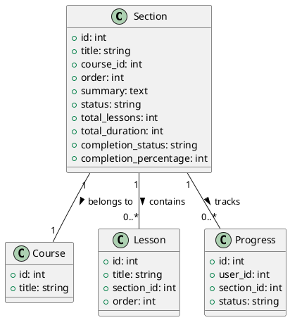

# Section Model Documentation

## Overview
The Section model is a core component of the LMS platform that handles course section management. Sections are used to organize lessons within courses, providing a structured learning experience. The model provides functionality for creating, updating, and managing course sections.

## Database Schema

### Sections Table
```sql
CREATE TABLE sections (
    id INT PRIMARY KEY AUTO_INCREMENT,
    title VARCHAR(255),
    course_id INT,
    order INT,
    summary TEXT,
    date_added TIMESTAMP,
    last_modified TIMESTAMP,
    status VARCHAR(50),
    total_lessons INT,
    total_duration INT,
    total_quiz INT,
    total_assignments INT,
    total_attachments INT,
    total_notes INT,
    total_comments INT,
    total_views INT,
    total_downloads INT,
    total_likes INT,
    total_dislikes INT,
    total_shares INT,
    total_reports INT,
    total_flags INT,
    total_bookmarks INT,
    total_highlights INT,
    total_annotations INT,
    completion_status VARCHAR(50),
    completion_percentage INT,
    completion_date TIMESTAMP
);
```

## Core Methods

### Section Management
- `add_section($course_id)`: Creates a new section
- `edit_section($section_id)`: Updates section details
- `delete_section($course_id, $section_id)`: Removes a section
- `get_section($type_by, $id)`: Retrieves section details
- `serialize_section($course_id, $serialization)`: Orders sections

### Content Management
- `get_section_lessons($section_id)`: Gets section lessons
- `update_section_order()`: Updates section ordering
- `get_section_progress()`: Tracks section completion
- `mark_section_completed()`: Updates completion status

## Data Structures

### Section Data
```php
$section_data = [
    'title' => string,
    'course_id' => int,
    'order' => int,
    'summary' => text,
    'status' => string,
    'total_lessons' => int,
    'total_duration' => int,
    'completion_status' => string,
    'completion_percentage' => int
];
```

### Section Order Data
```php
$section_order = [
    'section_id' => int,
    'order' => int,
    'course_id' => int
];
```

## Security Features
- Input validation
- Access control
- Data sanitization
- Error handling
- Order validation

## Integration Points
- Course system
- Lesson system
- Progress tracking
- Content organization
- Learning path

## Migration Considerations
1. Implement proper validation
2. Add proper error handling
3. Implement proper logging
4. Add proper events
5. Create proper repositories
6. Add proper services

## Testing Requirements
1. Section creation tests
2. Section update tests
3. Section deletion tests
4. Order management tests
5. Progress tracking tests
6. Access control tests
7. Integration tests

## PlantUML Diagram


## Usage Examples

### Creating a Section
```php
$section_data = [
    'title' => 'Introduction to Programming',
    'course_id' => 1,
    'order' => 1,
    'summary' => 'Basic programming concepts'
];
$this->add_section($section_data);
```

### Updating Section Order
```php
$section_order = [
    ['section_id' => 1, 'order' => 1],
    ['section_id' => 2, 'order' => 2],
    ['section_id' => 3, 'order' => 3]
];
$this->serialize_section($course_id, json_encode($section_order));
```

### Getting Section Progress
```php
$progress = $this->get_section_progress($section_id, $user_id);
```

## Best Practices
1. Always validate section order
2. Maintain section hierarchy
3. Track section completion
4. Handle section dependencies
5. Validate section content
6. Manage section access
7. Monitor section progress 