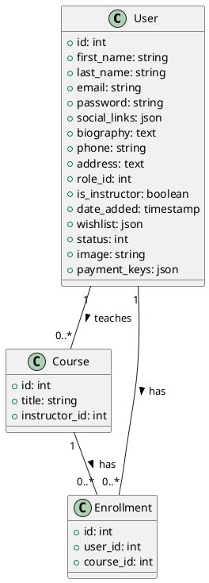

# User Model Documentation

## Overview
The User model is a core component of the LMS platform, handling user management, authentication, and instructor-related functionality. It extends the CI_Model class and provides comprehensive user management capabilities.

## Database Schema

### Users Table
```sql
CREATE TABLE users (
    id INT PRIMARY KEY AUTO_INCREMENT,
    first_name VARCHAR(255),
    last_name VARCHAR(255),
    email VARCHAR(255) UNIQUE,
    password VARCHAR(255),
    social_links JSON,
    biography TEXT,
    phone VARCHAR(255),
    address TEXT,
    role_id INT,
    is_instructor BOOLEAN,
    date_added TIMESTAMP,
    wishlist JSON,
    status INT,
    image VARCHAR(255),
    payment_keys JSON
);
```

## Core Methods

### User Management
- `get_user($user_id)`: Retrieves a specific user by ID
- `get_all_user($user_id)`: Gets all users or a specific user
- `add_user($is_instructor, $is_admin)`: Creates a new user
- `edit_user($user_id)`: Updates user information
- `delete_user($user_id)`: Removes a user

### Authentication
- `register_user($data)`: Handles user registration
- `change_password($user_id)`: Updates user password
- `unlock_screen_by_password($password)`: Handles screen unlocking
- `session_destroy()`: Manages session termination

### Instructor Management
- `get_instructor($id)`: Retrieves instructor details
- `get_instructor_list()`: Gets all instructors
- `update_instructor_paypal_settings($user_id)`: Updates PayPal settings
- `update_instructor_stripe_settings($user_id)`: Updates Stripe settings
- `update_instructor_razorpay_settings($user_id)`: Updates Razorpay settings

### Course Management
- `my_courses($user_id)`: Gets user's enrolled courses
- `get_number_of_active_courses_of_instructor($instructor_id)`: Counts instructor's active courses

### Social Features
- `toggle_following($instructor_id, $user_id)`: Manages instructor following
- `is_following($instructor_id, $user_id)`: Checks following status
- `get_following_instructors($user_id)`: Gets followed instructors

## Security Features
- Password hashing using SHA1
- Email duplication checking
- Session management
- Role-based access control

## Integration Points
- Payment gateway integration
- Social media integration
- Course enrollment system
- Instructor application system

## Migration Considerations
1. Update password hashing to use more secure algorithm (e.g., bcrypt)
2. Implement proper role-based access control
3. Add proper validation and sanitization
4. Implement proper session management
5. Add proper error handling

## Testing Requirements
1. User creation and validation
2. Authentication flow
3. Role-based access control
4. Instructor management
5. Course enrollment
6. Payment integration
7. Social features

## PlantUML Diagram
