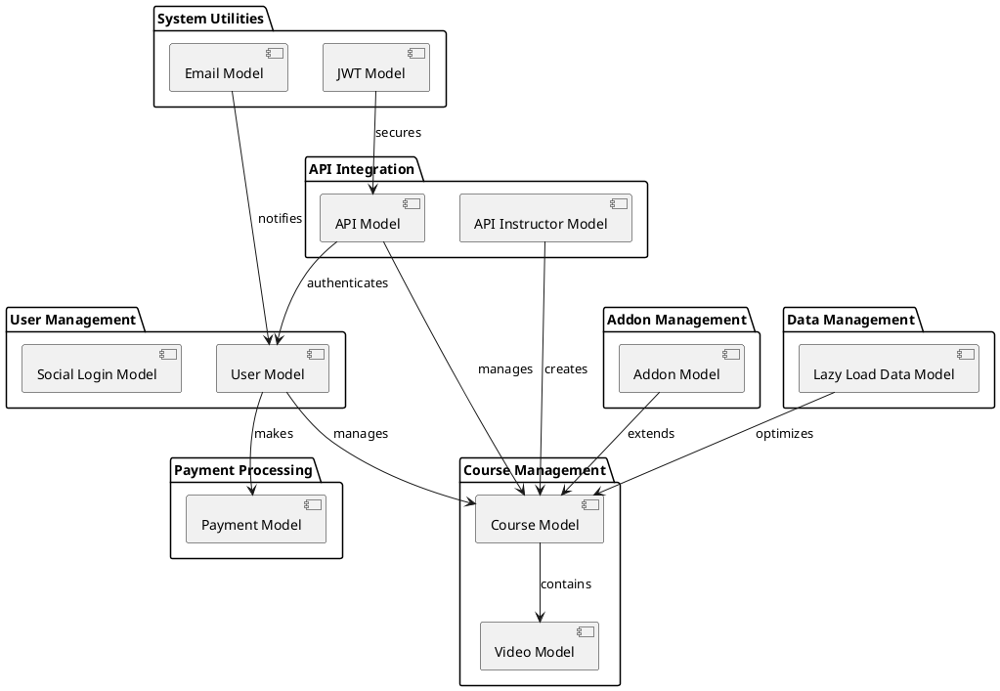

# Core Model Analysis

## User Management

### User Model
- **File**: `User_model.php`
- **Size**: 36KB, 894 lines
- **Responsibilities**:
  - User authentication and authorization
  - Profile management
  - Role-based access control
- **Key Features**:
  - User registration and login
  - Password management
  - Role and permission handling
  - Profile updates

### Social Login Model
- **File**: `Social_login_modal.php`
- **Size**: 6.3KB, 155 lines
- **Responsibilities**:
  - Social media authentication
  - OAuth integration
- **Key Features**:
  - Multiple provider support
  - User data synchronization
  - Token management

## Course Management

### Course Model
- **File**: `Crud_model.php`
- **Size**: 224KB, 5490 lines
- **Responsibilities**:
  - Course CRUD operations
  - Content management
  - Enrollment handling
- **Key Features**:
  - Course creation and updates
  - Content organization
  - Student enrollment
  - Progress tracking

### Video Model
- **File**: `Video_model.php`
- **Size**: 5.0KB, 135 lines
- **Responsibilities**:
  - Video content management
  - Streaming configuration
- **Key Features**:
  - Video upload and storage
  - Streaming optimization
  - Progress tracking

## Payment Processing

### Payment Model
- **File**: `Payment_model.php`
- **Size**: 40KB, 1026 lines
- **Responsibilities**:
  - Payment processing
  - Subscription management
  - Transaction handling
- **Key Features**:
  - Multiple payment gateway support
  - Subscription management
  - Transaction logging
  - Refund processing

## API Integration

### API Model
- **File**: `Api_model.php`
- **Size**: 54KB, 1465 lines
- **Responsibilities**:
  - API request handling
  - Response formatting
  - Authentication
- **Key Features**:
  - Request validation
  - Response formatting
  - Rate limiting
  - Error handling

### API Instructor Model
- **File**: `Api_instructor_model.php`
- **Size**: 49KB, 1427 lines
- **Responsibilities**:
  - Instructor-specific API operations
  - Course management
  - Student interaction
- **Key Features**:
  - Course creation
  - Student management
  - Progress tracking
  - Analytics

## System Utilities

### Email Model
- **File**: `Email_model.php`
- **Size**: 39KB, 960 lines
- **Responsibilities**:
  - Email communication
  - Template management
- **Key Features**:
  - Template system
  - Queue management
  - Delivery tracking

### JWT Model
- **File**: `Jwt_model.php`
- **Size**: 881B, 34 lines
- **Responsibilities**:
  - JWT token management
  - Authentication
- **Key Features**:
  - Token generation
  - Validation
  - Refresh handling

## Addon Management

### Addon Model
- **File**: `Addon_model.php`
- **Size**: 6.5KB, 210 lines
- **Responsibilities**:
  - Addon management
  - Feature toggling
- **Key Features**:
  - Addon installation
  - Configuration
  - Version management

## Data Management

### Lazy Load Data Model
- **File**: `Lazyloaddata_model.php`
- **Size**: 5.0KB, 145 lines
- **Responsibilities**:
  - Optimized data loading
  - Performance management
- **Key Features**:
  - Lazy loading
  - Caching
  - Performance optimization

## Model Relationships

## Migration Strategy

### Phase 1: Core Models
1. User and Authentication
2. Course Management
3. Payment Processing

### Phase 2: API Layer
1. API Models
2. Integration Services
3. Security Implementation

### Phase 3: Utilities
1. Email System
2. JWT Implementation
3. Addon Framework

### Phase 4: Optimization
1. Lazy Loading
2. Caching
3. Performance Tuning

## Key Features by Model

### User_model.php
- User registration and authentication
- Profile management
- Role-based permissions
- Social login integration
- Password reset functionality

### Payment_model.php
- Multiple payment gateway support
- Subscription management
- Invoice generation
- Refund processing
- Payment history tracking

### Api_model.php
- RESTful API endpoints
- Authentication middleware
- Request validation
- Response formatting
- Error handling

### Video_model.php
- Video upload and storage
- Streaming configuration
- Progress tracking
- Quality settings
- Playlist management

### Api_instructor_model.php
- Course management
- Student enrollment
- Performance analytics
- Revenue tracking
- Content moderation

## Database Schema Considerations

1. **User Table**
   - Primary key: id
   - Unique constraints: email, username
   - Indexes: email, role, status

2. **Course Table**
   - Primary key: id
   - Foreign key: instructor_id
   - Indexes: status, category

3. **Payment Table**
   - Primary key: id
   - Foreign keys: user_id, course_id
   - Indexes: status, payment_date

4. **Video Table**
   - Primary key: id
   - Foreign key: course_id
   - Indexes: status, duration

## Security Considerations

1. **Data Protection**
   - Password hashing
   - Token encryption
   - Secure session management

2. **Access Control**
   - Role-based permissions
   - API key management
   - Rate limiting

3. **Input Validation**
   - Data sanitization
   - XSS prevention
   - SQL injection protection

## Modularization Strategy

1. **Service Boundaries**
   - Authentication Service: User_model, Jwt_model, Social_login_modal
   - Content Service: Video_model, Academy_cloud_model
   - Payment Service: Payment_model
   - API Service: Api_model, Api_instructor_model
   - Notification Service: Email_model
   - Addon Service: Addon_model

2. **Data Separation**
   - Tenant-specific data isolation
   - Shared service data management
   - Cross-tenant data access patterns

3. **Integration Points**
   - API endpoints for external systems
   - Event-driven communication
   - Message queue integration

4. **Migration Considerations**
   - Data model refactoring
   - Service boundary definition
   - API versioning strategy 