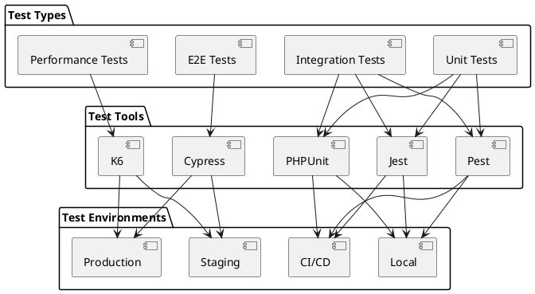

# Testing Strategy

## Overview

This document outlines the comprehensive testing strategy for the Learning Management System (LMS) platform. The strategy covers various types of testing to ensure the quality, reliability, and performance of the system.

## Testing Architecture



## Unit Testing

### PHP Unit Tests
```php
<?php

namespace Tests\Unit;

use PHPUnit\Framework\TestCase;
use App\Services\UserService;

class UserServiceTest extends TestCase {
    public function testCreateUser() {
        $userService = new UserService();
        $user = $userService->createUser([
            'name' => 'Test User',
            'email' => 'test@example.com'
        ]);
        
        $this->assertInstanceOf(User::class, $user);
        $this->assertEquals('Test User', $user->name);
    }
}
```

### JavaScript Unit Tests
```javascript
import { UserService } from '@/services/user';

describe('UserService', () => {
    it('creates a user successfully', async () => {
        const userService = new UserService();
        const user = await userService.createUser({
            name: 'Test User',
            email: 'test@example.com'
        });
        
        expect(user).toBeDefined();
        expect(user.name).toBe('Test User');
    });
});
```

## Integration Testing

### API Integration Tests
```php
<?php

namespace Tests\Integration;

use PHPUnit\Framework\TestCase;
use App\Services\CourseService;

class CourseServiceTest extends TestCase {
    public function testEnrollUserInCourse() {
        $courseService = new CourseService();
        $enrollment = $courseService->enrollUser(1, 1);
        
        $this->assertTrue($enrollment->success);
        $this->assertEquals('enrolled', $enrollment->status);
    }
}
```

### Service Integration Tests
```javascript
import { CourseService } from '@/services/course';
import { PaymentService } from '@/services/payment';

describe('Course Enrollment', () => {
    it('handles course enrollment with payment', async () => {
        const courseService = new CourseService();
        const paymentService = new PaymentService();
        
        const course = await courseService.getCourse(1);
        const payment = await paymentService.processPayment({
            courseId: course.id,
            amount: course.price
        });
        
        const enrollment = await courseService.enrollUser(1, payment.id);
        expect(enrollment.status).toBe('enrolled');
    });
});
```

## End-to-End Testing

### Cypress Tests
```javascript
describe('Course Enrollment Flow', () => {
    it('completes course enrollment process', () => {
        cy.visit('/courses');
        cy.get('.course-card').first().click();
        cy.get('.enroll-button').click();
        
        cy.get('#payment-form').within(() => {
            cy.get('input[name="cardNumber"]').type('4111111111111111');
            cy.get('input[name="expiry"]').type('12/25');
            cy.get('input[name="cvv"]').type('123');
            cy.get('button[type="submit"]').click();
        });
        
        cy.url().should('include', '/dashboard');
        cy.get('.enrolled-courses').should('contain', 'Course Title');
    });
});
```

## Performance Testing

### K6 Tests
```javascript
import http from 'k6/http';
import { check, sleep } from 'k6';

export default function() {
    const response = http.get('https://api.lms.example.com/courses');
    
    check(response, {
        'status is 200': (r) => r.status === 200,
        'response time < 500ms': (r) => r.timings.duration < 500
    });
    
    sleep(1);
}
```

## Test Coverage Requirements

### Unit Tests
- Minimum coverage: 80%
- Focus areas:
  - Business logic
  - Data validation
  - Error handling
  - Edge cases

### Integration Tests
- Minimum coverage: 70%
- Focus areas:
  - API endpoints
  - Service interactions
  - Database operations
  - External integrations

### End-to-End Tests
- Minimum coverage: 50%
- Focus areas:
  - Critical user journeys
  - Payment processing
  - Course enrollment
  - User authentication

### Performance Tests
- Response time: < 500ms
- Error rate: < 1%
- Concurrent users: 1000
- Throughput: 100 requests/second

## CI/CD Integration

### GitHub Actions Configuration
```yaml
name: Test Suite

on: [push, pull_request]

jobs:
  test:
    runs-on: ubuntu-latest
    
    steps:
    - uses: actions/checkout@v2
    
    - name: Setup PHP
      uses: shivammathur/setup-php@v2
      with:
        php-version: '8.1'
        
    - name: Install dependencies
      run: composer install
        
    - name: Run PHPUnit tests
      run: vendor/bin/phpunit
        
    - name: Setup Node.js
      uses: actions/setup-node@v2
      with:
        node-version: '16'
        
    - name: Install npm dependencies
      run: npm install
        
    - name: Run Jest tests
      run: npm test
        
    - name: Run Cypress tests
      run: npm run test:e2e
        
    - name: Run K6 tests
      run: k6 run tests/performance/course-api.js
```

## Test Data Management

### Fixtures
```php
<?php

namespace Tests\Fixtures;

class UserFixture {
    public static function createUser() {
        return [
            'name' => 'Test User',
            'email' => 'test@example.com',
            'password' => 'password123'
        ];
    }
}
```

### Factories
```php
<?php

namespace Tests\Factories;

class CourseFactory {
    public static function create($attributes = []) {
        return array_merge([
            'title' => 'Test Course',
            'description' => 'Test Description',
            'price' => 99.99
        ], $attributes);
    }
}
```

### Seeding
```php
<?php

namespace Tests\Seeders;

class TestSeeder {
    public function run() {
        $this->createTestUsers();
        $this->createTestCourses();
        $this->createTestEnrollments();
    }
}
```

## Monitoring and Reporting

### Test Results Tracking
- Automated test result collection
- Historical performance data
- Failure analysis
- Trend monitoring

### Continuous Monitoring
- Real-time test execution
- Performance metrics
- Error tracking
- Resource utilization

### Reporting
- Daily test summaries
- Weekly performance reports
- Monthly quality metrics
- Quarterly improvement plans

## Best Practices

### Test Organization
- Clear test naming
- Logical grouping
- Consistent structure
- Documentation

### Test Maintenance
- Regular updates
- Refactoring
- Cleanup
- Version control

### Test Documentation
- Test purpose
- Setup requirements
- Expected outcomes
- Known issues

### Performance Optimization
- Parallel execution
- Resource management
- Caching
- Cleanup procedures 